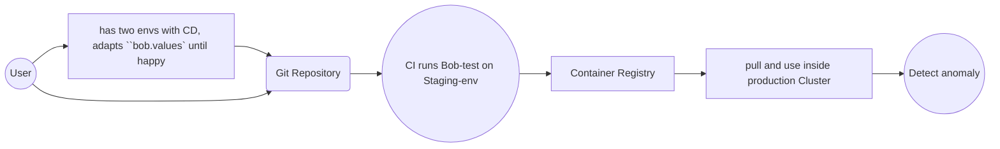

```mermaid
flowchart LR

A --> F[has two envs with CD, adapts ``bob.values` until happy]
F --> B
A((User)) --> B(Git Repository)
B --> C((CI runs Bob-test on Staging-env))
C --> D[Container Registry ]
D --> G[pull and use inside production Cluster]
G --> H((Detect anomaly))
``` 
