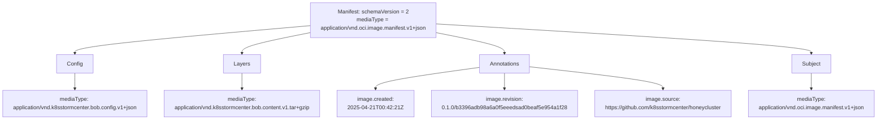
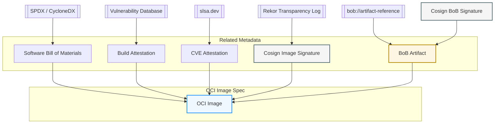
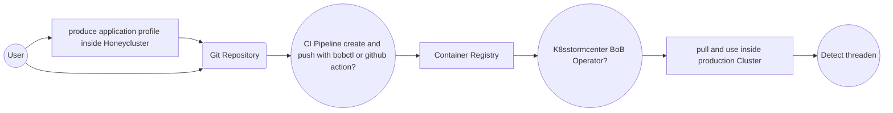
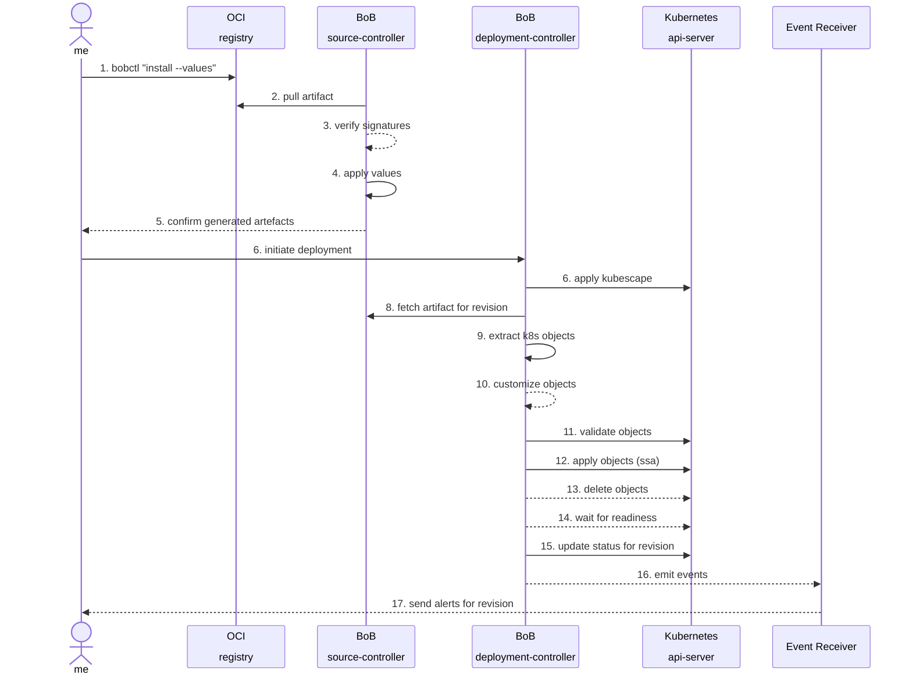

Idea: WIP 

* use co-sign or oras
* determine choice of key (can we use keyless?)
* attestation: choose predicate type
* verfication: can tools like OPA verfiy predicate-type= bob.spdx.json
* transparency: do we need public signing records, like recor?

__Huge thanks to the Flux and KubeScape communities!__
The artifact handling approach we've implemented is directly inspired by your pioneering work.

It builds upon Flux's support for OCI artifacts with signing, providing a secure and standardized way to distribute and verify content.
<!-- It’s also deeply influenced by the Falco project's rule handling, which helped shape our vision for flexible and policy-driven artifact consumption. -->

Your innovations and open collaboration continue to inspire and enable the broader cloud-native ecosystem. Thank you for leading the way! 


## Sketch
### Authoring artifacts - Ideas for bob-cli

__NOTE__: Better explain bob-artifact
__NOTE__: This `bobctl` at this moment doesn't exists!

On the client side, `bobctl` provides commands to push and pull security artifacts into OCI artifacts and pushing these artifact to container registries. A bob artifact include tracing policies, attack models, and runtime configurations.

These artifacts can be used in environments like [k8sstormcenter](https://github.com/k8sstormcenter/honeycluster.git) to simulate and analyze threats.

The bobctl CLI commands for managing BoB artifacts are:

- `bobctl push artifact`
- `bobctl pull artifact`
- `bobctl tag artifact`
- `bobctl list artifact`
- `bobctl describe artifact`
  - List bob manifest
  - Meta informations (annotations)
- `bobctl link artifact <bob artifact> <image artifact>`
  - Reference which image
- `bobctl create secret`

The OCI artifacts produced with `bobctl push artifact` have the following custom media types:

::remark-box
---
kind: warning
---
__Question__: C to P: can we have a yaml or does it have to be json?
::


- artifact media type `application/vnd.oci.image.manifest.v1+json`
- config media type `application/vnd.k8sstormcenter.bob.config.v1+json`
- content media type `application/vnd.k8sstormcenter.bob.content.v1.tar+gzip`

This shows how the BoB OCI artifact is structured:

- A manifest links to a config object and one or more layers
- The config describes metadata (here, BoB-specific).
- Each layer contains actual content (e.g., ~~kustomize~~ YAML files, BoB manifest (values + yaml), BoB test).
::remark-box
---
kind: warning
---
__Question__: C to P: kustomize doesnt really work as far as I tested, helm could work - not yet tested
::
- An annotations provide extra metadata for humans and tools.
- A subject specifies a descriptor of another manifest to attach a signature (cosign or notary).



__WIP__: Definition of BoB Artifact Manifest

To support platform-specific BoB (Bill of Behaviour) artifacts within a single OCI-compliant image, the OCI Image Index (a.k.a. manifest list) can be leveraged to define a set of platform-targeted manifests. Each manifest can correspond to a specific OS/architecture combination, allowing fine-grained association of artifacts per platform.
Furthermore, the config object within each image manifest can be utilized to transport structured metadata (e.g., media type, labels, annotations, or custom JSON data). This mechanism enables embedding auxiliary information (e.g., BoB version, build metadata, artifact links) directly within the OCI image specification in a platform-aware manner.
The official [OCI Image Annotations specification](https://github.com/opencontainers/image-spec/blob/main/annotations.md) provides a standardized way to embed metadata within OCI image manifests and config objects.

__NOTE__: At present, the config object in the OCI image manifest is mainly utilized to support image integrity checks, serving as part of the content-addressable structure of the image.

Config needs a hash to test integrity of the content of bob artifact folder `.rootfs.diff_ids[0]`.

```json
{
  "created": "2025-05-04T00:42:21Z",
  "config": {
  }
  "rootfs": {
    "type": "layers",
    "diff_ids": [
      "sha256:9803b474e9216bc407ccec87418061bf084954d9752136e0b2d12c328fe5b7ba"
    ]
  },
}
```

__NOTE__: Add support for different architectures and os's needed? __CR__: Multi-Arch definitely required

The checksum caclulated of the layer.tar.gz:

```text
computed_digest = sha256(layer.tar.gz)
```

#### FORMAT: application/vnd.k8sstormcenter.bob.content.v1.tar+gzip

```shell
bobctl push artifact oci://registry.iximiuz.com/k8sstormcenter/manifests/honey:$(git rev-parse --short HEAD) \
	--path="./traces/kubescape-verify/attacks/bob" \
	--source="$(git config --get remote.origin.url)" \
	--revision="$(git branch --show-current)@sha1:$(git rev-parse HEAD)"
```

`bobctl` has the ability to convert the `bob.yaml` together with the `bob.values` and the `deployment.yaml`
into a mini `helm-chart` __WIP__ CR I didnt yet write it as HELM, but the test function woudl make a lot of sense.
The most crucial thing we need are loop-like structures (either `list` or `range`) that can deal with network blocks.
I suspect that on customer-side, the `bob.yaml` will need to be modified quite a bit. 


#### Reference BoB Artifact to an OCI Image

Key metadata associated with OCI images that enhance security and traceability, such as SBOMs, vulnerability attestations, signatures (e.g., Cosign), and provenance data (e.g., SLSA).




__WIP__: Useful Security References from OCI Image Artifacts.

- __OCI Image__: Central artifact being published.
- __SBOM__: Linked via OCI manifest annotations (typically as attestations or referrers).
- __CVE Attestation__: Security scan results, often attached via in-toto.
- __Cosign Signature__: Verifies integrity and authorship of the image.
- __Bob Artifact__: A custom reference (e.g., bob://...) pointing to further metadata or build context.
- __Build Provenance__: Describes the build process, tools, and environment used to produce the artifact, following the SLAS -framework.

__Note__: All artifacts that are references form the OCI Image must be signed!

#### POC: Create and bob artifact manually

Prepare

```shell
mkdir ~/downloads
cd ~/downloads
curl -s https://api.github.com/repos/oras-project/oras/releases/latest \
| grep "browser_download_url.*linux_amd64.tar.gz" \
| cut -d '"' -f 4 \
| wget -i -
tar -xvzf oras_*_linux_amd64.tar.gz
sudo mv oras /usr/local/bin/
cd $HOME
oras version
```

```shell
cd $HOME/honeycluster
mkdir -p bob-artifact 
cd bob-artifact
# upload applicationprofile
cp /home/laborant/honeycluster/traces/kubescape-verify/attacks/bob/bob_generated.yaml .
cp /home/laborant/honeycluster/traces/kubescape-verify/attacks/bob/deploy_test.yaml .
cp /home/laborant/honeycluster/traces/kubescape-verify/attacks/bob/bob_generated.values .

# Add metafile with License and author?
# https://specs.opencontainers.org/image-spec/annotations/
# https://spdx.org/licenses/
# cat >manifest.yaml <<EOF
# apiVersion: k8sstormcenter.io/v1alpha1
# kind: BoBManifest
# spec
#   author: Peter Rossbach
#   licenses: Apache-2.0
# EOF

__NOTE__ CR:  we can probably use the kubescape manifest for now. Lets test

# package with tar und zip
BOB_PACKAGE=app-profile-webapp.tar.gz 
tar czf ../${BOB_PACKAGE} .
cd ..

ARTIFACT_PACKAGE=registry.iximiuz.com/k8sstormcenter/manifest/honey

# create Config checksum
cat >config.json <<EOF
{
  "created": "$(date -u +"%Y-%m-%dT%H:%M:%SZ")",
  "rootfs": {
    "type": "layers",
    "diff_ids": [
      "sha256:$(sha256sum ${BOB_PACKAGE} | cut -d' ' -f1)"
    ]
  },
}
EOF

# review manifest

CONFIG_DIGEST="sha256:$(sha256sum config.json | cut -d' ' -f1)"
CONFIG_SIZE=$(wc -c < config.json)

# Digest for layer
LAYER_DIGEST="sha256:$(sha256sum ${BOB_PACKAGE} | cut -d' ' -f1)"
LAYER_SIZE=$(wc -c < ${BOB_PACKAGE})

VERSION=$((git describe --tags --abbrev=0 2>/dev/null || echo "main") && exit 0)
COMMIT=$(git rev-parse HEAD)

# echo "\"org.opencontainers.image.revision\": \"$VERSION/$COMMIT\""

# How you can manually create a manifest?
cat >manifest.json <<EOF
{
    "schemaVersion": 2,
    "mediaType": "application/vnd.oci.image.manifest.v1+json",
    "config": {
        "mediaType": "application/vnd.k8sstormcenter.bob.config.v1+json",
        "size": $CONFIG_SIZE,
        "digest": "$CONFIG_DIGEST"
    },
    "layers": [
        {
        "mediaType": "application/vnd.k8sstormcenter.bob.content.v1.tar+gzip",
        "size": $LAYER_SIZE,
        "digest": "$LAYER_DIGEST"
        }
    ],
    "annotations": {
        "org.opencontainers.image.created": "$(date -u +"%Y-%m-%dT%H:%M:%SZ")",
        "org.opencontainers.image.revision": "$VERSION/$COMMIT",
        "org.opencontainers.image.source": "https://github.com/k8sstormcenter/honeycluster"
    }
}
EOF

# https://oras.land/docs/how_to_guides/manifest_annotations/


# but better options is:

cat >annotations.json <<EOF
{
  "\$manifest": {
     "org.opencontainers.image.created": "$(date -u +"%Y-%m-%dT%H:%M:%SZ")",
     "org.opencontainers.image.revision": "$VERSION/$COMMIT",
     "org.opencontainers.image.source": "https://github.com/k8sstormcenter/honeycluster"
  }
}
EOF

# upload image manifest
# upload blobs layer tar
# upload config manifest

oras push --annotation-file annotations.json \
  ${ARTIFACT_PACKAGE}:latest \
  --config config.json:application/vnd.k8sstormcenter.bob.config.v1+json \
  ${BOB_PACKAGE}:application/vnd.k8sstormcenter.bob.content.v1.tar+gzip

__NOTE__ CR: at this point we have a bit of a chicken egg problem: cause inside the bob, there is the SHA
and but to get the SHA we need to push it? I think, we have at least two hashes here.
So: we first push the image (multiarch) so it gets a unique SHA and then we use that and push the signed metastuff?

# check upload
oras discover ${ARTIFACT_PACKAGE}:latest
registry.iximiuz.com/k8sstormcenter/manifest/honey@sha256:9fafbb7da542abf2e1f04832b5cd39a3225d7381328e144401a7db230cc1dc63

oras manifest fetch ${ARTIFACT_PACKAGE}:latest --pretty  

# fetch layer
ARTIFACT_BLOB=${ARTIFACT_PACKAGE}@$(oras manifest fetch ${ARTIFACT_PACKAGE}:latest --pretty | jq -r .layers[0].digest)
oras blob fetch --output - \
  $ARTIFACT_BLOB \
  >registry-${BOB_PACKAGE}

# happyness check
WORKDIR=$(mktemp -d)
IMG1_DIR="$WORKDIR/img1"
IMG2_DIR="$WORKDIR/img2"

mkdir -p "$IMG1_DIR" "$IMG2_DIR"

# Unpack image layers
mkdir -p $IMG1_DIR/unpacked $IMG2_DIR/unpacked

tar -xzf ${BOB_PACKAGE} -C $IMG1_DIR/unpacked
tar -xzf registry-${BOB_PACKAGE} -C $IMG2_DIR/unpacked

# Diff the contents
diff -urN $IMG1_DIR/unpacked $IMG2_DIR/unpacked > $WORKDIR/diff.txt

echo "Binary diff stored at: $WORKDIR/diff.txt"

rmdir $WORKDIR

# fetch manifest + config

oras manifest fetch-config ${ARTIFACT_PACKAGE}:latest
```

### this should be moved to unit-1?
#### POC: reference BoB Artifact to OCI Image

Let's dive into OCI (Open Container Initiative) referrers, especially in the context of the OCI Artifacts v1.1 spec which introduced the referrers API.
OCI referrers are a standardized way to attach related artifacts (like SBOMs, signatures, or policies) to an OCI image or artifact in a registry — without modifying the original image.

- OCI Referrers let you attach related artifacts to an image without modifying it.
- They're discoverable via a referrers API.
- They’re a key building block for modern supply chain tooling — signatures, SBOMs, provenance.

```shell
# 0. Prepare
mkdir -p  bob-artifact 
cd bob-artifact

# 1. Define the base image you're referencing
IMAGE=ghcr.io/k8sstormcenter/webapp@sha256:e323014ec9befb76bc551f8cc3bf158120150e2e277bae11844c2da6c56c0a2b

IMAGE=k8sstormcenter/webapp@sha256:e323014ec9befb76bc551f8cc3bf158120150e2e277bae11844c2da6c56c0a2b

docker run -d \
  --name zot \
  -p 5000:5000 \
  ghcr.io/project-zot/zot:v2.1.2

# 2. Download to local registry
docker pull ghcr.io/$IMAGE
#docker tag ghcr.io/$IMAGE \
#  registry.iximiuz.com/k8sstormcenter/webapp:latest
#docker push registry.iximiuz.com/k8sstormcenter/webapp:latest

docker tag ghcr.io/$IMAGE \
  127.0.0.1:5000/k8sstormcenter/webapp:latest
docker push 127.0.0.1:5000/k8sstormcenter/webapp:latest

# 3. Prepare the Bob artifact (e.g., JSON file)
#echo '{ "build": "bob", "arch": "amd64", "url": "https://bob.artifact/reference" }' > bob-artifact.json

#cp kustomize/app-profile-webapp.yaml bob-artifact.yaml CR TODO
# 4. Attach the artifact using oras (as an OCI artifact referrer)

# zot
oras attach 127.0.0.1:5000/k8sstormcenter/webapp:latest --plain-http  \
  --artifact-type "application/vnd.bob.artifact+yaml" \
  --annotation "org.opencontainers.artifact.description=BoB Security Policy" \
   \
 bob_generated.yaml:application/yaml
 deploy_test.yaml:application/yaml CR TODO can we append all 3 files
 bob_generated.values:application/text CR CHECK TODO

# ixi registry
oras attach registry.iximiuz.com/k8sstormcenter/webapp:latest  \
  --artifact-type "application/vnd.bob.artifact+yaml" \
  --annotation "org.opencontainers.artifact.description=BoB Security Policy" \
   \
  bob-artifact.yaml:application/yaml
✓ Uploaded  application/vnd.oci.empty.v1+json                                            2/2  B 100.00%    9ms
  └─ sha256:44136fa355b3678a1146ad16f7e8649e94fb4fc21fe77e8310c060f61caaff8a
✓ Uploaded  bob-artifact.yaml                                                          18/18 KB 100.00%    8ms
  └─ sha256:39b2f67bfb5fecae7beb30c73e6b2c2512f877ecd25d3827778efd4bd122197e
✓ Uploaded  application/vnd.oci.image.manifest.v1+json                               813/813  B 100.00%   14ms
  └─ sha256:191a03218f7f1200232265b7cde605daf6070f0d3e873e34f6ed9399d62d0322
Attached to [registry] registry.iximiuz.com/k8sstormcenter/webapp@sha256:dab18b4d7784d33644f02f88e4df384c37cfc8a4c038e345af24d6d666d12e0e
Digest: sha256:191a03218f7f1200232265b7cde605daf6070f0d3e873e34f6ed9399d62d0322
```

What's happening here:

- A new artifact with a reference is create and push to the registry
- __--artifact-type__: Custom media type for the artifact (`application/vnd.bob.artifact+json`).
- __--plain-http__: Optional if use local registry with plain http.
- __registry.iximiuz.com/k8sstormcenter/webapp:latest__: A new OCI reference storing the metadata.
- __bob-artifact.yaml:application/yaml__: Links this artifact as a referrer to the OCI image.

This attaches your artifact in a way that tools like oras discover or cosign can find it under the base image.

Discovering referrers:

```shell
oras discover ghcr.io/$IMAGE          
ghcr.io/k8sstormcenter/webapp@sha256:e323014ec9befb76bc551f8cc3bf158120150e2e277bae11844c2da6c56c0a2b

# discover referrer
# zot registry
oras discover 127.0.0.1:5000/k8sstormcenter/webapp:latest plain-http

# ixi registry
oras discover registry.iximiuz.com/k8sstormcenter/webapp:latest 
registry.iximiuz.com/k8sstormcenter/webapp@sha256:dab18b4d7784d33644f02f88e4df384c37cfc8a4c038e345af24d6d666d12e0e
└── application/vnd.bob.artifact+yaml
    └── sha256:191a03218f7f1200232265b7cde605daf6070f0d3e873e34f6ed9399d62d0322
```

You’ll see your Bob artifact listed as a referrer to that image.

What’s happening behind the scenes?

The oras attach command:

- Adds the artifact (e.g.,`bob-artifact.json`) as a new OCI artifact.
- Links it to the `registry.iximiuz.com/k8sstormcenter/webapp:latest` image via a special referrers API.
- Creates metadata (e.g., media type, annotations) so tools can discover and fetch these referrers later.

Show the manifest from the new bob artifact to refer the image.

```text
 GET /v2/<name>/referrers/<digest>?artifactType=application/vnd.bob.artifact+yaml
```

bob-artifact.yaml is the artifact that is referenced to the image.

```shell
# ixi registry
# request bob-artifact
oras discover  \
--artifact-type application/yaml \
registry.iximiuz.com/k8sstormcenter/webapp@sha256:191a03218f7f1200232265b7cde605daf6070f0d3e873e34f6ed9399d62d0322

# zot registry
oras discover --plain-http \
--artifact-type application/yaml \
127.0.0.1:5000/k8sstormcenter/webapp@sha256:191a03218f7f1200232265b7cde605daf6070f0d3e873e34f6ed9399d62d0322

# request image
# ixi registry
curl -s -H "Accept: application/vnd.oci.image.index.v1+json, application/vnd.oci.image.manifest.v1+json, application/vnd.docker.distribution.manifest.v2+json" \
https://registry.iximiuz.com/v2/k8sstormcenter/webapp/manifests/sha256:dab18b4d7784d33644f02f88e4df384c37cfc8a4c038e345af24d6d666d12e0e |jq .

# zot registry
curl -s -H "Accept: application/vnd.oci.image.index.v1+json, application/vnd.oci.image.manifest.v1+json, application/vnd.docker.distribution.manifest.v2+json" \
http://127.0.0.1:5000/v2/k8sstormcenter/webapp/manifests/sha256:dab18b4d7784d33644f02f88e4df384c37cfc8a4c038e345af24d6d666d12e0e |jq .

# ixi registry
curl -s -H "Accept: application/vnd.oci.image.index.v1+json, application/vnd.oci.image.manifest.v1+json, application/vnd.docker.distribution.manifest.v2+json" \
https://registry.iximiuz.com/v2/k8sstormcenter/webapp/manifests/sha256:dab18b4d7784d33644f02f88e4df384c37cfc8a4c038e345af24d6d666d12e0e |jq .
{
  "schemaVersion": 2,
  "mediaType": "application/vnd.oci.image.index.v1+json",
  "manifests": [
    {
      "mediaType": "application/vnd.oci.image.manifest.v1+json",
      "digest": "sha256:191a03218f7f1200232265b7cde605daf6070f0d3e873e34f6ed9399d62d0322",
      "size": 813,
      "annotations": {
        "org.opencontainers.artifact.description": "BoB Security Policy",
        "org.opencontainers.image.created": "2025-05-09T10:40:22Z"
      },
      "artifactType": "application/vnd.bob.artifact+yaml"
    }
  ]
}


# only zot registry support referrers
curl -sL -H "Accept: application/json" \
 https://registry.iximiuz.com/k8sstormcenter/webapp/referrers/sha256:dab18b4d7784d33644f02f88e4df384c37cfc8a4c038e345af24d6d666d12e0e?artifactType=application/vnd.bob.artifact+yaml
# 404

curl -sL -H "Accept: application/vnd.oci.image.index.v1+json"   \
 127.0.0.1:5000/v2/k8sstormcenter/webapp/referrers/sha256:dab18b4d7784d33644f02f88e4df384c37cfc8a4c038e345af24d6d666d12e0e ?artifactType=application/vnd.bob.artifact+yaml \
  | jq .

oras manifest fetch --plain-http 127.0.0.1:5000/k8sstormcenter/webapp@sha256:dab18b4d7784d33644f02f88e4df384c37cfc8a4c038e345af24d6d666d12e0e
# no subject!

# my wish
{
  "schemaVersion": 2,
  "mediaType": "application/vnd.oci.image.manifest.v1+json",
  "artifactType": "application/vnd.bob.artifact+json",
  "config": {
    "mediaType": "application/vnd.oci.empty.v1+json",
    "digest": "sha256:44136fa355b3678a1146ad16f7e8649e94fb4fc21fe77e8310c060f61caaff8a",
    "size": 2,
    "data": "e30="
  },
  "layers": [
    {
      "mediaType": "application/yaml",
      "digest": "sha256:cd661a568dbe340f8ed7a542e0ba24bc47ff0106d2c219dc0ec93cc3a01ab7ea",
      "size": 77,
      "annotations": {
        "org.opencontainers.image.title": "bob-artifact.yaml"
      }
    }
  ],
  "subject": {
    "mediaType": "application/vnd.docker.distribution.manifest.v2+json",
    "digest": "sha256:a46e19e923c1aebefbc6c561749230ff6f097ad89faee7c4206d916fab498119",
    "size": 739
  },
  "annotations": {
    "org.opencontainers.artifact.description": "BoB Security Policy",
    "org.opencontainers.image.created": "2025-04-19T08:12:58Z"
  }
}
```

Show the OCI image manifest! 

__NOTE__: No subject refer the bob artifact!

```shell
oras manifest fetch $IMAGE --pretty --plain-http 
{
  "schemaVersion": 2,
  "mediaType": "application/vnd.docker.distribution.manifest.v2+json",
  "config": {
    "mediaType": "application/vnd.docker.container.image.v1+json",
    "size": 2376,
    "digest": "sha256:3594acf667b2bc448df45921c993042890042d7ecc53d5e70f0cc2da59322687"
  },
  "layers": [
    {
      "mediaType": "application/vnd.docker.image.rootfs.diff.tar.gzip",
      "size": 2207025,
      "digest": "sha256:cd784148e3483c2c86c50a48e535302ab0288bebd587accf40b714fffd0646b3"
    },
    {
      "mediaType": "application/vnd.docker.image.rootfs.diff.tar.gzip",
      "size": 3030947,
      "digest": "sha256:5dd70daad9005c8316e9a6646645e53cd5748c9fe0cf4dd00ce04835d6b839d4"
    }
  ]
}
```
<!--
### Consuming artifacts - Idea

 On the server side, bob-artifact integrates with tools like k8sstormcenter to deploy and monitor eBPF artifacts. It collects runtime data, such as syscall traces and network activity, to identify potential vulnerabilities and attack vectors.

Example tracing policy for k8sstormcenter:

__NOTE__: How controller consume bob-artifact? Which information are needed?
- Format like Falco rule set?
- SBOM Format
- Which artifact references of images or software components are needed?

```yaml
apiVersion: source.k8sstormcenter.io/v1alpha1
kind: OCIRepository
metadata:
  name: k8sstormcenter-honey
  namespace: default
spec:
  interval: 10m
  url: oci://ghcr.io/k8sstormcenter/manifests/honey
  ref:
    tag: latest
---
apiVersion: kustomize.k8sstormcenter.io/v1alpha1
kind: BoB
metadata:
  name: honey
  namespace: default
spec:
  interval: 10m
  targetNamespace: default
  prune: true
  sourceRef:
    kind: OCIRepository
    name: k8sstormcenter-honey
  path: ./
```

On the server-side, K8sstormcenter pulls OCI artifacts from container registries, extracts the ApplicationProfile as kubernetes manifests and reconciles them on the tracking controller.

## Workflow examples

Following are examples for deploying a demo application profile to Kubernetes using manifests stored in git.

__Note__: How the bob deploy flow works?

- Config?
- Create bob profile by using the application inside a HoneyCluster. 
- Extract the profile and store to folder/git
- Create and push bob to oci registry
- Production controller pull oci artifact and use it inside cluster
- Controller protocol threads
-->



### Deploy stable on production

Push the latest release from Git to the container registry:

```shell
git checkout x.x.x

bobctl push artifact oci://registry.iximiuz.com/k8sstormcenter/manifests/honey:$(git tag --points-at HEAD) \
	--path="./kustomize" \
	--source="$(git config --get remote.origin.url)" \
	--revision="$(git tag --points-at HEAD)@sha1:$(git rev-parse HEAD)"
```

Tag the release as stable:

```shell
bobctl tag artifact oci://registry.iximiuz.com/8sstormcenter/manifests/honey:$(git tag --points-at HEAD) \
  --tag stable
```

Deploy the latest stable build on the production cluster:

```yaml
apiVersion: source.k8sstormcenter.io/v1alpha1
kind: OCIRepository
metadata:
  name: k8sstormcenter-honey
  namespace: default
spec:
  interval: 5m
  url: oci://registry.iximiuz.com/k8sstormcenter/manifests/honey
  ref:
    tag: stable
```

Or deploy the latest version by semver:

```yaml
apiVersion: k8sstormcenter.io/v1alpha1
kind: OCIRepository
metadata:
  name: k8sstormcenter-honey
  namespace: default
spec:
  interval: 5m
  url: oci://registry.iximiuz.com/k8sstormcenter/manifests/honey
  ref:
    semver: ">=1.0.0"
```

## Authentication

Bob Artifacts works with Docker Hub, GitHub and GitLab Container Registry,
ACR, ECR, GAR, Harbor, self-hosted Docker Registry and
any other registry which supports custom OCI media types.

For authentication purposes, the `bobctl <verb> artifact` commands are using the `~/.docker/config.json`
config file and the Docker credential helpers.

__NOTE__: Login to GitHub Container Registry example:

```shell
echo ${GITHUB_PAT} | docker login ghcr.io -u ${GITHUB_USER} --password-stdin
```

__Note__: We use local lab registry `registry.iximiuz.com`!

To pull artifacts in Kubernetes clusters, BoB Operator can authenticate to container registries
using image pull secrets or IAM role bindings to the `bob-controller` service account.

Generate an image pull secret for GitHub Container Registry example:

```shell
bobctl create secret oci ghcr-auth \
  --url=ghcr.io \
  --username=bob \
  --password=${GITHUB_PAT}
```

Then reference the secret in the `OCIRepository` with:

```yaml
apiVersion: source.k8sstormcenter.io/v1alpha1
kind: OCIRepository
metadata:
  name: k8sstormcenter-honey
  namespace: default
spec:
  interval: 5m
  url: oci://registry.iximiuz.com/k8sstormcenter/manifests/honey
  provider: generic
  secretRef:
    name: ghcr-auth
```

### Contextual Authorization

When running BoB on managed Kubernetes clusters like EKS, AKS or GKE, you
can set the `provider` field to `azure`, `aws` or `gcp` and BoB will use
the Kubernetes node credentials or an IAM Role binding to pull artifacts
without needing an image pull secret.

For more details on how to setup contextual authorization for Azure, AWS and Google Cloud please see:

- [OCIRepository documentation](/bob/components/source/ocirepositories/#provider)

## Signing and verification

BoB comes with support for verifying OCI artifacts signed with [Sigstore Cosign](https://github.com/sigstore/cosign)
or [Notaryproject notation](https://github.com/notaryproject/notation).

To secure your delivery pipeline, you can sign the artifacts and configure Flux
to verify the artifacts' signatures before they are downloaded and reconciled in production.

### Cosign Workflow example

```shell
COSIGN_VERSION=$(curl -s https://api.github.com/repos/sigstore/cosign/releases/latest | grep tag_name | cut -d '"' -f4)
curl -sLo cosign "https://github.com/sigstore/cosign/releases/download/${COSIGN_VERSION}/cosign-linux-amd64"
chmod +x cosign
sudo mv cosign /usr/local/bin/
```

Generate a Cosign key-pair and create a Kubernetes secret with the public key:

```shell
cosign version
cosign generate-key-pair

kubectl -n default create secret generic cosign-pub \
  --from-file=cosign.pub=cosign.pub
```

Push and sign the artifact using the Cosign private key:

```shell
bobctl push artifact oci://registry.iximiuz.com/k8sstormcenter/manifests/honey:$(git tag --points-at HEAD) \
	--path="./kustomize" \
	--source="$(git config --get remote.origin.url)" \
	--revision="$(git tag --points-at HEAD)@sha1:$(git rev-parse HEAD)"

cosign sign --key=cosign.key registry.iximiuz.com//k8sstormcenter/manifests/honey:$(git tag --points-at HEAD)
```

Configure k8sstormcenter to verify the artifacts using the Cosign public key from the Kubernetes secret:

```yaml
apiVersion: source.k8sstormcenter.io/v1alpha1
kind: OCIRepository
metadata:
  name: k8sstormcenter-honey
  namespace: default
spec:
  interval: 5m
  url: oci://registry.iximiuz.com/k8sstormcenter/manifests/honey
  ref:
    semver: "*"
  verify:
    provider: cosign
    secretRef:
      name: cosign-pub
```

{}
For publicly available OCI artifacts, which are signed using
the [Cosign Keyless](https://docs.sigstore.dev/cosign/keyless/)
method, you can enable the verification by omitting the `.verify.secretRef` field.

Note that keyless verification is an **experimental feature**, using
custom root CAs or self-hosted Rekor instances are not currently supported.
{}

### Notary Workflow example

Generate a local signing key pair:

```shell
openssl req -x509 -sha256 -nodes -newkey rsa:2048 \
-keyout <name>.key \
-out <name>.crt \
-days 365 \
-subj "/C=DE/ST=NRW/L=Bochum/O=Notary/CN=<name>" \
-addext "basicConstraints=CA:false" \
-addext "keyUsage=critical,digitalSignature" \
-addext "extendedKeyUsage=codeSigning"
```

Configure notation to use the local key:

```shell
cat <<EOF > ~/.config/notation/signingkeys.json
{
    "default": "<key-name>"
    "keys": [
        {
            "name": "<key-name>",
            "keyPath": "<path-to-key>.key",
            "certPath": "<path-to-cert>.crt"
        }
    ]
}
```

You should now be able to list the keys:

```shell
notation key ls
```

It is also possible to generate a test certificate:

```shell
# Generate a certificate and RSA key pair
notation cert generate-test valid-example
```

{}
The test certificate is not suitable for production use. Please 
visit the [notation documentation](https://notaryproject.dev/docs/user-guides/how-to/plugin-management/)
for more information on how to use the notation plugin for production.
{}

Push and sign the artifact using the certificate's private key:

```shell
bobctl push artifact oci://registry.iximiuz.com/k8sstormcenter/manifests/honey:$(git tag --points-at HEAD) \
	--path="./kustomize" \
	--source="$(git config --get remote.origin.url)" \
	--revision="$(git tag --points-at HEAD)@sha1:$(git rev-parse HEAD)"

notation sign registry.iximiuz.com/k8sstormcenter/manifests/honey:$(git tag --points-at HEAD) -k <key-name>
```

Create a `trustpolicy.json` file:

```json
{
    "version": "1.0",
    "trustPolicies": [
        {
            "name": "<policy-name>",
            "registryScopes": [ 
                "registry.iximiuz.com/k8sstormcenter/manifests/honey"
             ],
            "signatureVerification": {
                "level" : "strict" 
            },
            "trustStores": [ "ca:<store-name>" ],
            "trustedIdentities": [
                "x509.subject: C=DE, ST=NRW, L=Bochum, O=Notary, CN=<name>"
            ]
        }
    ]
}
```

{}
For more details see [trust policy spec](https://github.com/notaryproject/specifications/blob/main/specs/trust-store-trust-policy.md#trust-policy)
{}

Generate a kubernetes secret with the certificate and trust policy:

```shell
bobctl create secret notation notation-cfg \
    --namespace=<namespace> \
    --trust-policy-file=<trust-policy-file-path> \
    --ca-cert-file=<ca-cert-file-path>
```

Configure Bob to verify the artifacts using the Notary trust policy and certificate:

```yaml
apiVersion: source.k8sstormcenter.io/v1alpha1
kind: OCIRepository
metadata:
  name: k8sstormcenter-honey
  namespace: default
spec:
  interval: 5m
  url: oci://registry.iximiuz.com/k8sstormcenter/manifests/honey
  ref:
    semver: "*"
  verify:
    provider: notation
    secretRef:
      name: notation-cfg
```

### Verification status

If the verification succeeds, BoB adds a condition with the
following attributes to the OCIRepository's `.status.conditions`:

- `type: SourceVerified`
- `status: "True"`
- `reason: Succeeded`

If the verification fails, BoB will set the `SourceVerified` status to `False`
and will not fetch the artifact contents from the registry. The verification
failure will report this to the OCIRepository ready status message.

```console
$ kubectl -n default describe ocirepository.source.k8sstormcenter.io k8sstormcenter-honey

Status:                        
  Conditions:
    Last Transition Time:     2025-04-18T00:42:21Z
    Message:                  failed to verify the signature using provider 'cosign': no matching signatures were found
    Observed Generation:      1
    Reason:                   VerificationError
    Status:                   False
    Type:                     Ready
```

Verification failures are also visible when running `bobctl get sources oci` and in Kubernetes events.

## Git commit status updates

Another important reason to specify the Git revision when publishing
artifacts with `bobctl push` is for benefiting from BoB's integration
with Git notification providers that support commit status updates:

```shell
bobctl push artifact oci://<repo url> --path=<manifests dir> \
	--source="$(git config --get remote.origin.url)" \
	--revision="$(git branch --show-current)@sha1:$(git rev-parse HEAD)"
```

When `bob-controller` finds OCI artifacts containing a revision
specified like in the example above, this *origin revision* is added
on events.


### Diagram: OCI artifacts reconciliation 



## Questions

- What mechanisms are available for consuming events emitted by the Bob Source Controller?
  - Are there recommended patterns or interfaces for downstream controllers or external systems to react to these events?
- What is the expected structure and content of a bob-artifact?
  - Does it include just compiled binaries, or are additional metadata, SBOMs, attestations, etc., also part of the artifact?
- How should multi-architecture support be handled within Bob?
  - Is it necessary to define a separate binary specification per architecture?
  - Should the Bob Controller be responsible for resolving the correct binary based on the target architecture?
  - How does this resolution behave in environments leveraging user-mode emulation (e.g., qemu-user, binfmt_misc)?
- What is the recommended approach to enable local Cosign + Rekor integration in environments where upstream tools lack native support?
  - For instance:
    - FluxCD does not support Cosign signing with Rekor integration out of the box.
    - The Falco project currently does not offer signing support for its artifacts.
  - Are there best practices or workarounds to enable trust workflows in these cases?
- How should Bob reference container images in the supply chain?
  - Should the reference be a conventional container image tag/digest?
  - Or should it be modeled using in-toto provenance (e.g., linking to SBOMs or signed attestations)?
- Who is responsible for implementing the Bob CLI and controller components?
  - Is this handled by a specific team or working group?
  - Are there any existing maintainers or contributors assigned to this effort?
How can support for additional source types be integrated into the system?
  - Are there extension points or plugin mechanisms available?
  - What would be the process for adding new source types (e.g., Git, OCI, HTTP, S3, etc.)?
- Include architectural diagrams and reference links to illustrate the overall system design.
  - Visualizing the component interactions, artifact flow, and trust chain would greatly enhance understanding.
  - References to related projects or specifications (e.g., OCI, in-toto, Cosign) would provide valuable context.

## References

- [Why You Need A Software Bill of Behaviors](https://blog.karambit.ai/why-you-need-a-software-bill-of-behaviors-and-why-an-sbom-isnt-enough-e61105f4f7ff)
- [OCI Image Specification](https://github.com/opencontainers/image-spec)  
  The specification governing container images, used as the foundation for artifact transport.
- [OCI Distribution Specification](https://github.com/opencontainers/distribution-spec)  
  Specification for the distribution of container images and other content using the OCI standard.
- [Open Component Model (OCM)](https://ocm.software)  
  A model and tooling for managing software components and their dependencies across supply chains.
- [OCM Specification](https://github.com/open-component-model/ocm-spec/blob/main/README.md)  
  Technical specification of the Open Component Model.
- [Container Image SBOM Artifacts (Docker)](https://docs.docker.com/build/metadata/attestations/sbom/)  
  Generating and attaching SBOMs as build attestations using Docker tooling.
- [in-toto](https://in-toto.io/)  
  Framework to secure the integrity of the software supply chain using metadata and attestations.
- [Flux OCI Artifact Support](https://fluxcd.io/flux/components/source/oci/)  
  Official documentation on Flux's support for OCI-based artifacts with optional signature verification.
- [FluxCD OCI Artifact Cheatsheet](https://fluxcd.io/flux/cheatsheets/oci-artifacts/)  
  - Guides and examples for managing artifacts with Flux:
    - Kustomize
    - Helm Charts
    - `flux push`, `pull`, `list`, `tag` commands for OCI artifacts
- [Falco OCI Rules](https://github.com/falcosecurity/falco/tree/main/rules)  
  Example of using OCI as a transport mechanism for Falco rules, inspiring flexible rule and artifact distribution.
- [Cosign](https://docs.sigstore.dev/cosign/overview)  
  Tool for signing, verifying, and storing container images and other artifacts.
- [Rekor Transparency Log](https://docs.sigstore.dev/rekor/overview)  
  Part of Sigstore, providing a tamper-evident log for signed metadata.
- [Flux Source Controller](https://fluxcd.io/flux/components/source/)  
  Core Flux component responsible for fetching and managing sources such as Git, Helm, and OCI artifacts.
- [binfmt_misc & QEMU Emulation](https://wiki.debian.org/QemuUserEmulation)  
  Documentation on enabling cross-architecture emulation for binary execution in container.

## Gloassary

- **Software Bill of Materials (SBOM)**
  A Software Bill of Materials (SBOM) is a detailed inventory of all components, libraries, and dependencies included in a software application, providing transparency into its composition to support security, compliance, and supply chain management.
- **Software Bill of Behaviour (SBOB) or (BoB)**  
  A Software Bill of Behaviors (SBoB) is an emerging concept aimed at capturing and documenting the runtime behavior of software components to enhance system security and threat detection.
- **Software Bill of Delivery (SBOD)**  
  A conceptual extension of SBOM, focusing on the delivery and runtime state of components and systems. The term SBOD is not officially defined, the Open Component Model (OCM).
- **Supplychain Levels for Software Artifacts (SLSA)**
  SLSA is a security framework that defines a set of standards and levels to ensure the integrity, authenticity, and traceability of software throughout its build and supply chain process.


<!-- to attest

```sh
cosign attest --predicate bob.spdx.json --type https://spdx.dev/Document registry.iximiuz.com/webapp:latest
```

to verify
```sh
cosign verify-attestation --type https://spdx.dev/Document registry.iximiuz.com/webapp:latest
```

Question:
can OPA verify the new predicate?

can OPA verify the signature? -->