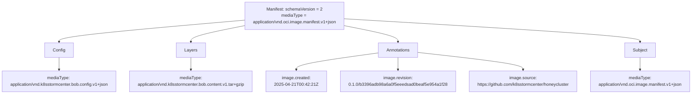

Idea: WIP 

* use co-sign or oras
* determine choice of key (can we use keyless?)
* attestation: choose predicate type
* verfication: can tools like OPA verfiy predicate-type= bob.spdx.json
* transparency: do we need public signing records, like recor?

__Huge thanks to the Flux and KubeScape communities!__
The artifact handling approach we've implemented is directly inspired by your pioneering work.

It builds upon Flux's support for OCI artifacts with signing, providing a secure and standardized way to distribute and verify content.
<!-- It’s also deeply influenced by the Falco project's rule handling, which helped shape our vision for flexible and policy-driven artifact consumption. -->

Your innovations and open collaboration continue to inspire and enable the broader cloud-native ecosystem. Thank you for leading the way! 


## Sketch
### Authoring artifacts - Ideas for bob-cli

__NOTE__: Better explain bob-artifact
__NOTE__: This `bobctl` at this moment doesn't exists!

On the client side, `bobctl` provides commands to push and pull security artifacts into OCI artifacts and pushing these artifact to container registries. A bob artifact include tracing policies, attack models, and runtime configurations.

These artifacts can be used in environments like [k8sstormcenter](https://github.com/k8sstormcenter/honeycluster.git) to simulate and analyze threats.

The bobctl CLI commands for managing BoB artifacts are:

- `bobctl push artifact`
- `bobctl pull artifact`
- `bobctl tag artifact`
- `bobctl list artifact`
- `bobctl describe artifact`
  - List bob manifest
  - Meta informations (annotations)
- `bobctl link artifact <bob artifact> <image artifact>`
  - Reference which image
- `bobctl create secret`

The OCI artifacts produced with `bobctl push artifact` have the following custom media types:

- artifact media type `application/vnd.oci.image.manifest.v1+json`
- config media type `application/vnd.k8sstormcenter.bob.config.v1+json`
- content media type `application/vnd.k8sstormcenter.bob.content.v1.tar+gzip`

This shows how the BoB OCI artifact is structured:

- A manifest links to a config object and one or more layers
- The config describes metadata (here, BoB-specific).
- Each layer contains actual content (e.g., kustomize YAML files, BoB manifest).
- An annotations provide extra metadata for humans and tools.
- A subject specifies a descriptor of another manifest to attach a signature (cosign or notatary).




to attest

```sh
cosign attest --predicate bob.spdx.json --type https://spdx.dev/Document registry.iximiuz.com/webapp:latest
```

to verify
```sh
cosign verify-attestation --type https://spdx.dev/Document registry.iximiuz.com/webapp:latest
```

Question:
can OPA verify the new predicate?

can OPA verify the signature?