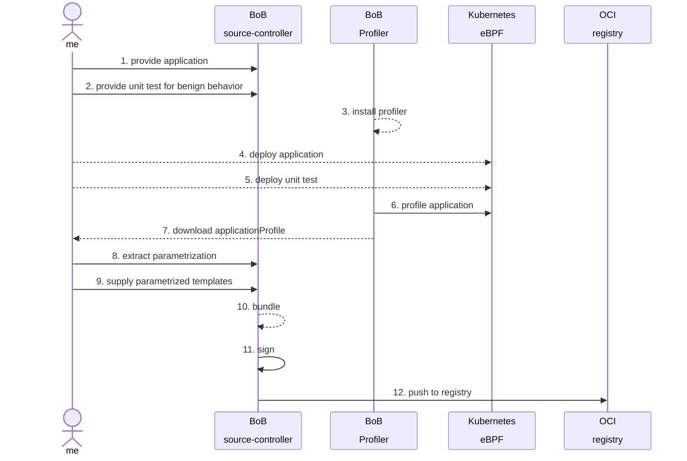
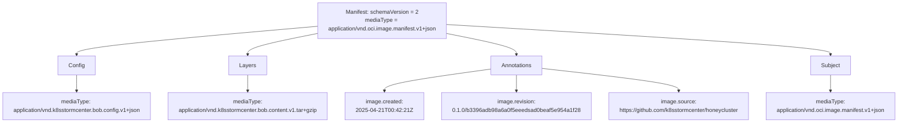
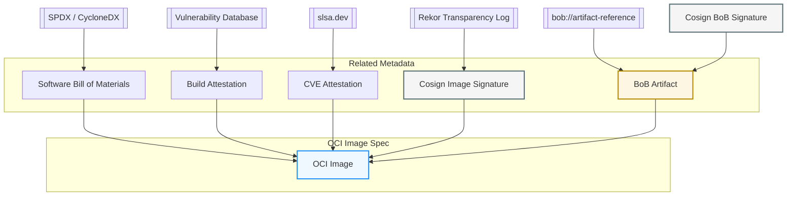

Idea: WIP 

* use co-sign or oras
* determine choice of key (can we use keyless?)
* attestation: choose predicate type
* verification: can tools like OPA verfiy predicate-type= bob.spdx.json
* transparency: do we need public signing records, like recor?
  
### Diagram of the publication of a BoB 



__Huge thanks to the OpenSource communities!__


## Sketch
### Authoring artifacts - Ideas for bobctl


On the client side, `bobctl` provides commands to bundle and sign security artifacts into OCI artifacts and pushing these artifact to container registries. 

The bobctl CLI commands for managing BoB artifacts are:

- `bobctl push artifact`
- `bobctl pull artifact`
- `bobctl tag artifact`
- `bobctl list artifact`
- `bobctl describe artifact`
  - List bob manifest
  - Meta informations (annotations)
- `bobctl link artifact <bob artifact> <image artifact>`
  - Reference which image
- `bobctl create secret`

The OCI artifacts produced with `bobctl push artifact` have the following custom media types:

::remark-box
---
kind: warning
---
__Question__: C to P: Do we need that many different types?
::


- artifact media type `application/vnd.oci.image.manifest.v1+json`
- config media type `application/vnd.k8sstormcenter.bob.config.v1+json`
- content media type `application/vnd.k8sstormcenter.bob.content.v1.tar+gzip`

This shows how the BoB OCI artifact is structured:

- A manifest links to a config object and one or more layers
- The config describes metadata (here, BoB-specific).
- Each layer contains actual content (e.g., ~~kustomize~~ YAML files, BoB manifest (values + yaml), BoB test).
::remark-box
---
kind: warning
---
__Question__: C to P: kustomize doesnt work as far as I tested, helm could work 
::
- An annotation provide extra metadata for humans and tools.
- A subject specifies a descriptor of another manifest to attach a signature (cosign or notary).

::remark-box
---
kind: warning
---
__Question__: C to P: I dont understand this diagram
::



__WIP__: Definition of BoB Artifact Manifest

To support platform-specific BoB (Bill of Behaviour) artifacts within a single OCI-compliant image, the OCI Image Index (a.k.a. manifest list) can be leveraged to define a set of platform-targeted manifests. Each manifest can correspond to a specific OS/architecture combination, allowing fine-grained association of artifacts per platform.
Furthermore, the config object within each image manifest can be utilized to transport structured metadata (e.g., media type, labels, annotations, or custom JSON data). This mechanism enables embedding auxiliary information (e.g., BoB version, build metadata, artifact links) directly within the OCI image specification in a platform-aware manner.
The official [OCI Image Annotations specification](https://github.com/opencontainers/image-spec/blob/main/annotations.md) provides a standardized way to embed metadata within OCI image manifests and config objects.

__NOTE__: At present, the config object in the OCI image manifest is mainly utilized to support image integrity checks, serving as part of the content-addressable structure of the image.

Config needs a hash to test integrity of the content of bob artifact folder `.rootfs.diff_ids[0]`.

```json
{
  "created": "2025-05-04T00:42:21Z",
  "config": {
  }
  "rootfs": {
    "type": "layers",
    "diff_ids": [
      "sha256:9803b474e9216bc407ccec87418061bf084954d9752136e0b2d12c328fe5b7ba"
    ]
  },
}
```

__NOTE__: Add support for different architectures and os's needed? __CR__: Multi-Arch definitely required

The checksum calculated of the layer.tar.gz:

```text
computed_digest = sha256(layer.tar.gz)
```

#### FORMAT: application/vnd.k8sstormcenter.bob.content.v1.tar+gzip

```shell
bobctl push artifact oci://registry.iximiuz.com/k8sstormcenter/manifests/honey:$(git rev-parse --short HEAD) \
	--path="./traces/kubescape-verify/attacks/bob" \
	--source="$(git config --get remote.origin.url)" \
	--revision="$(git branch --show-current)@sha1:$(git rev-parse HEAD)"
```

`bobctl` has the ability to convert the `bob.yaml` together with the `bob.values` and the `deployment.yaml`
into a mini `helm-chart` __WIP__ CR I didnt yet write it as HELM, but the test function woudl make a lot of sense.
The most crucial thing we need are loop-like structures (either `list` or `range`) that can deal with network blocks.
I suspect that on customer-side, the `bob.yaml` will need to be modified quite a bit. 


#### Reference BoB Artifact to an OCI Image

Key metadata associated with OCI images that enhance security and traceability, such as SBOMs, vulnerability attestations, signatures (e.g., Cosign), and provenance data (e.g., SLSA).




__WIP__: Useful Security References from OCI Image Artifacts.

- __OCI Image__: Central artifact being published.
- __SBOM__: Linked via OCI manifest annotations (typically as attestations or referrers). (NOT IN SCOPE)
- __CVE Attestation__: Security scan results, often attached via in-toto. (NOT IN SCOPE)
- __Cosign Signature__: Verifies integrity and authorship of the image.
- __Bob Artifact__: A custom reference (e.g., bob://...) pointing to further metadata or build context.
- __Build Provenance__: Describes the build process, tools, and environment used to produce the artifact, following the SLAS -framework. (NOT IN SCOPE)

__Note__: All artifacts that are references form the OCI Image `should` be signed! __CR__ we must also allow unsigned `BoBs` for people to get started.

#### POC: Create and bob artifact manually

Prepare

```shell
mkdir ~/downloads
cd ~/downloads
curl -s https://api.github.com/repos/oras-project/oras/releases/latest \
| grep "browser_download_url.*linux_amd64.tar.gz" \
| cut -d '"' -f 4 \
| wget -i -
tar -xvzf oras_*_linux_amd64.tar.gz
sudo mv oras /usr/local/bin/
cd $HOME
oras version
```

```shell
cd $HOME/honeycluster
mkdir -p bob-artifact 
cd bob-artifact
# upload applicationprofile
cp /home/laborant/honeycluster/traces/kubescape-verify/attacks/bob/bob_generated.yaml .
cp /home/laborant/honeycluster/traces/kubescape-verify/attacks/bob/bob.test .
cp /home/laborant/honeycluster/traces/kubescape-verify/attacks/bob/bob_generated.values .

# Add metafile with License and author? CR: so you mean to state who wrote the bob, rather than who wrote the software?
# https://specs.opencontainers.org/image-spec/annotations/
# https://spdx.org/licenses/
# cat >manifest.yaml <<EOF
# apiVersion: k8sstormcenter.io/v1alpha1
# kind: BoBManifest
# spec
#   author: Peter Rossbach
#   licenses: Apache-2.0
# EOF


# package with tar und zip
BOB_PACKAGE=app-profile-webapp.tar.gz 
tar czf ../${BOB_PACKAGE} .
cd ..

ARTIFACT_PACKAGE=registry.iximiuz.com/k8sstormcenter/manifest/honey

# create Config checksum
cat >config.json <<EOF
{
  "created": "$(date -u +"%Y-%m-%dT%H:%M:%SZ")",
  "rootfs": {
    "type": "layers",
    "diff_ids": [
      "sha256:$(sha256sum ${BOB_PACKAGE} | cut -d' ' -f1)"
    ]
  },
}
EOF

# review manifest

CONFIG_DIGEST="sha256:$(sha256sum config.json | cut -d' ' -f1)"
CONFIG_SIZE=$(wc -c < config.json)

# Digest for layer
LAYER_DIGEST="sha256:$(sha256sum ${BOB_PACKAGE} | cut -d' ' -f1)"
LAYER_SIZE=$(wc -c < ${BOB_PACKAGE})

VERSION=$((git describe --tags --abbrev=0 2>/dev/null || echo "main") && exit 0)
COMMIT=$(git rev-parse HEAD)

# echo "\"org.opencontainers.image.revision\": \"$VERSION/$COMMIT\""

# How you can manually create a manifest?
cat >manifest.json <<EOF
{
    "schemaVersion": 2,
    "mediaType": "application/vnd.oci.image.manifest.v1+json",
    "config": {
        "mediaType": "application/vnd.k8sstormcenter.bob.config.v1+json",
        "size": $CONFIG_SIZE,
        "digest": "$CONFIG_DIGEST"
    },
    "layers": [
        {
        "mediaType": "application/vnd.k8sstormcenter.bob.content.v1.tar+gzip",
        "size": $LAYER_SIZE,
        "digest": "$LAYER_DIGEST"
        }
    ],
    "annotations": {
        "org.opencontainers.image.created": "$(date -u +"%Y-%m-%dT%H:%M:%SZ")",
        "org.opencontainers.image.revision": "$VERSION/$COMMIT",
        "org.opencontainers.image.source": "https://github.com/k8sstormcenter/honeycluster"
    }
}
EOF

# https://oras.land/docs/how_to_guides/manifest_annotations/


# but better options is:

cat >annotations.json <<EOF
{
  "\$manifest": {
     "org.opencontainers.image.created": "$(date -u +"%Y-%m-%dT%H:%M:%SZ")",
     "org.opencontainers.image.revision": "$VERSION/$COMMIT",
     "org.opencontainers.image.source": "https://github.com/k8sstormcenter/honeycluster"
  }
}
EOF

# upload image manifest
# upload blobs layer tar
# upload config manifest

oras push --annotation-file annotations.json \
  ${ARTIFACT_PACKAGE}:latest \
  --config config.json:application/vnd.k8sstormcenter.bob.config.v1+json \
  ${BOB_PACKAGE}:application/vnd.k8sstormcenter.bob.content.v1.tar+gzip

__NOTE__ CR: at this point we have a bit of a chicken egg problem: cause inside the bob, there is the SHA
and but to get the SHA we need to push it? I think, we have at least two hashes here.
So: we first push the image (multiarch) so it gets a unique SHA and then we use that and push the signed metastuff?

# check upload
oras discover ${ARTIFACT_PACKAGE}:latest
registry.iximiuz.com/k8sstormcenter/manifest/honey@sha256:9fafbb7da542abf2e1f04832b5cd39a3225d7381328e144401a7db230cc1dc63

oras manifest fetch ${ARTIFACT_PACKAGE}:latest --pretty  

# fetch layer
ARTIFACT_BLOB=${ARTIFACT_PACKAGE}@$(oras manifest fetch ${ARTIFACT_PACKAGE}:latest --pretty | jq -r .layers[0].digest)
oras blob fetch --output - \
  $ARTIFACT_BLOB \
  >registry-${BOB_PACKAGE}

# happyness check
WORKDIR=$(mktemp -d)
IMG1_DIR="$WORKDIR/img1"
IMG2_DIR="$WORKDIR/img2"

mkdir -p "$IMG1_DIR" "$IMG2_DIR"

# Unpack image layers
mkdir -p $IMG1_DIR/unpacked $IMG2_DIR/unpacked

tar -xzf ${BOB_PACKAGE} -C $IMG1_DIR/unpacked
tar -xzf registry-${BOB_PACKAGE} -C $IMG2_DIR/unpacked

# Diff the contents
diff -urN $IMG1_DIR/unpacked $IMG2_DIR/unpacked > $WORKDIR/diff.txt

echo "Binary diff stored at: $WORKDIR/diff.txt"

rmdir $WORKDIR

# fetch manifest + config

oras manifest fetch-config ${ARTIFACT_PACKAGE}:latest
```

### this should be moved to unit-1?
#### POC: reference BoB Artifact to OCI Image

Let's dive into OCI (Open Container Initiative) referrers, especially in the context of the OCI Artifacts v1.1 spec which introduced the referrers API.
OCI referrers are a standardized way to attach related artifacts (like SBOMs, signatures, or policies) to an OCI image or artifact in a registry — without modifying the original image.

- OCI Referrers let you attach related artifacts to an image without modifying it.
- They're discoverable via a referrers API.
- They’re a key building block for modern supply chain tooling — signatures, SBOMs, provenance.

```shell
# 0. Prepare
mkdir -p  bob-artifact 
cd bob-artifact

# 1. Define the base image you're referencing
IMAGE=ghcr.io/k8sstormcenter/webapp@sha256:e323014ec9befb76bc551f8cc3bf158120150e2e277bae11844c2da6c56c0a2b

IMAGE=k8sstormcenter/webapp@sha256:e323014ec9befb76bc551f8cc3bf158120150e2e277bae11844c2da6c56c0a2b

docker run -d \
  --name zot \
  -p 5000:5000 \
  ghcr.io/project-zot/zot:v2.1.2

# 2. Download to local registry
docker pull ghcr.io/$IMAGE
#docker tag ghcr.io/$IMAGE \
#  registry.iximiuz.com/k8sstormcenter/webapp:latest
#docker push registry.iximiuz.com/k8sstormcenter/webapp:latest

docker tag ghcr.io/$IMAGE \
  127.0.0.1:5000/k8sstormcenter/webapp:latest
docker push 127.0.0.1:5000/k8sstormcenter/webapp:latest

# 3. Prepare the Bob artifact (e.g., JSON file)
#echo '{ "build": "bob", "arch": "amd64", "url": "https://bob.artifact/reference" }' > bob-artifact.json

#cp kustomize/app-profile-webapp.yaml bob-artifact.yaml CR TODO
# 4. Attach the artifact using oras (as an OCI artifact referrer)

# zot
oras attach 127.0.0.1:5000/k8sstormcenter/webapp:latest --plain-http  \
  --artifact-type "application/vnd.bob.artifact+yaml" \
  --annotation "org.opencontainers.artifact.description=BoB Security Policy" \
   \
 bob_generated.yaml:application/yaml \
 bob.test:application/yaml \
 bob_generated.values:application/text 

# ixi registry
oras attach registry.iximiuz.com/k8sstormcenter/webapp:latest  \
  --artifact-type "application/vnd.bob.artifact+yaml" \
  --annotation "org.opencontainers.artifact.description=BoB Security Policy" \
   \
  bob-artifact.yaml:application/yaml
✓ Exists    application/vnd.oci.empty.v1+json                   2/2  B 100.00%     0s
  └─ sha256:44136fa355b3678a1146ad16f7e8649e94fb4fc21fe77e8310c060f61caaff8a
✓ Uploaded  bob.test                                      1.62/1.62 KB 100.00%    5ms
  └─ sha256:16b90fdcca596952bfb053b5454eef720a2dde8b7278f28eff43520d3cb6b60e
✓ Uploaded  bob_generated.values                            192/192  B 100.00%    6ms
  └─ sha256:6dabf2e0e01a3eb39fbea2df74445842e3a73d7429f27fb7339b70e890541e3e
✓ Exists    bob_generated.yaml                            18.2/18.2 KB 100.00%     0s
  └─ sha256:8f956060effdd6df20c9c49b5f6f4c80e3b7efdf7c49cb69fdbd403530c1a4c0
✓ Uploaded  application/vnd.oci.image.manifest.v1+json    1.17/1.17 KB 100.00%    5ms
  └─ sha256:52456e38289837346a7d6eb4647fb1efd1b7efb2000e3f64a9ddab049f946b4e
Attached to [registry] registry.iximiuz.com/k8sstormcenter/webapp@sha256:dab18b4d7784d33644f02f88e4df384c37cfc8a4c038e345af24d6d666d12e0e
Digest: sha256:191a03218f7f1200232265b7cde605daf6070f0d3e873e34f6ed9399d62d0322
```

What's happening here:

- A new artifact with a reference is create and push to the registry
- __--artifact-type__: Custom media type for the artifact (`application/vnd.bob.artifact+json`).
- __--plain-http__: Optional if use local registry with plain http.
- __registry.iximiuz.com/k8sstormcenter/webapp:latest__: A new OCI reference storing the metadata.
- __bob-artifact.yaml:application/yaml__: Links this artifact as a referrer to the OCI image.

This attaches your artifact in a way that tools like oras discover or cosign can find it under the base image.

Discovering referrers:

```shell
oras discover ghcr.io/$IMAGE          
ghcr.io/k8sstormcenter/webapp@sha256:e323014ec9befb76bc551f8cc3bf158120150e2e277bae11844c2da6c56c0a2b

# discover referrer
# zot registry
oras discover 127.0.0.1:5000/k8sstormcenter/webapp:latest --plain-http
127.0.0.1:5000/k8sstormcenter/webapp@sha256:dab18b4d7784d33644f02f88e4df384c37cfc8a4c038e345af24d6d666d12e0e
└── application/vnd.bob.artifact+yaml
    ├── sha256:ff905f36f27f3f82e62240b4d0ca4a7c22cb0dff3bc5039e9302d5591f628bfc
    ├── sha256:d61f3da3f2406061469718b3eb99b30b6a393673047ee4a493d4d94dc97b36a8
    ├── sha256:52456e38289837346a7d6eb4647fb1efd1b7efb2000e3f64a9ddab049f946b4e
    └── sha256:4c2e430fc6025297ac03653b761ee6f4f1d8612cd081bbeb986e0bd0e5776072

# # ixi registry
# oras discover registry.iximiuz.com/k8sstormcenter/webapp:latest 
# registry.iximiuz.com/k8sstormcenter/webapp@sha256:dab18b4d7784d33644f02f88e4df384c37cfc8a4c038e345af24d6d666d12e0e
# └── application/vnd.bob.artifact+yaml
#     └── sha256:191a03218f7f1200232265b7cde605daf6070f0d3e873e34f6ed9399d62d0322
```

You’ll see your Bob artifact listed as a referrer to that image.

What’s happening behind the scenes?

The oras attach command:

- Adds the artifact (e.g.,`bob-artifact.json`) as a new OCI artifact.
- Links it to the `registry.iximiuz.com/k8sstormcenter/webapp:latest` image via a special referrers API.
- Creates metadata (e.g., media type, annotations) so tools can discover and fetch these referrers later.

Show the manifest from the new bob artifact to refer the image.

```text
 GET /v2/<name>/referrers/<digest>?artifactType=application/vnd.bob.artifact+yaml
```

bob-artifact.yaml is the artifact that is referenced to the image.

```shell
# # ixi registry
# # request bob-artifact
# oras discover  \
# --artifact-type application/yaml \
# registry.iximiuz.com/k8sstormcenter/webapp@sha256:191a03218f7f1200232265b7cde605daf6070f0d3e873e34f6ed9399d62d0322

# zot registry
oras discover --plain-http --artifact-type application/yaml 127.0.0.1:5000/k8sstormcenter/webapp:latest
127.0.0.1:5000/k8sstormcenter/webapp@sha256:dab18b4d7784d33644f02f88e4df384c37cfc8a4c038e345af24d6d666d12e0e

# # request image
# # ixi registry
# curl -s -H "Accept: application/vnd.oci.image.index.v1+json, application/vnd.oci.image.manifest.v1+json, application/vnd.docker.distribution.manifest.v2+json" \
# https://registry.iximiuz.com/v2/k8sstormcenter/webapp/manifests/sha256:dab18b4d7784d33644f02f88e4df384c37cfc8a4c038e345af24d6d666d12e0e |jq .

# zot registry
curl -s -H "Accept: application/vnd.oci.image.index.v1+json, application/vnd.oci.image.manifest.v1+json, application/vnd.docker.distribution.manifest.v2+json" \
http://127.0.0.1:5000/v2/k8sstormcenter/webapp/manifests/sha256:dab18b4d7784d33644f02f88e4df384c37cfc8a4c038e345af24d6d666d12e0e |jq .

# ixi registry
curl -s -H "Accept: application/vnd.oci.image.index.v1+json, application/vnd.oci.image.manifest.v1+json, application/vnd.docker.distribution.manifest.v2+json" \
https://registry.iximiuz.com/v2/k8sstormcenter/webapp/manifests/sha256:dab18b4d7784d33644f02f88e4df384c37cfc8a4c038e345af24d6d666d12e0e |jq .
{
  "schemaVersion": 2,
  "mediaType": "application/vnd.oci.image.index.v1+json",
  "manifests": [
    {
      "mediaType": "application/vnd.oci.image.manifest.v1+json",
      "digest": "sha256:191a03218f7f1200232265b7cde605daf6070f0d3e873e34f6ed9399d62d0322",
      "size": 813,
      "annotations": {
        "org.opencontainers.artifact.description": "BoB Security Policy",
        "org.opencontainers.image.created": "2025-05-09T10:40:22Z"
      },
      "artifactType": "application/vnd.bob.artifact+yaml"
    }
  ]
}


# only zot registry support referrers
curl -sL -H "Accept: application/json" \
 https://registry.iximiuz.com/k8sstormcenter/webapp/referrers/sha256:dab18b4d7784d33644f02f88e4df384c37cfc8a4c038e345af24d6d666d12e0e?artifactType=application/vnd.bob.artifact+yaml
# 404


# I like it :)
curl -sL -H "Accept: application/vnd.oci.image.index.v1+json"   \
 127.0.0.1:5000/v2/k8sstormcenter/webapp/referrers/sha256:dab18b4d7784d33644f02f88e4df384c37cfc8a4c038e345af24d6d666d12e0e ?artifactType=application/vnd.bob.artifact+yaml \
  | jq .


oras manifest fetch --plain-http 127.0.0.1:5000/k8sstormcenter/webapp@sha256:dab18b4d7784d33644f02f88e4df384c37cfc8a4c038e345af24d6d666d12e0e
# no subject!

# my wish
{
  "schemaVersion": 2,
  "mediaType": "application/vnd.oci.image.manifest.v1+json",
  "artifactType": "application/vnd.bob.artifact+json",
  "config": {
    "mediaType": "application/vnd.oci.empty.v1+json",
    "digest": "sha256:44136fa355b3678a1146ad16f7e8649e94fb4fc21fe77e8310c060f61caaff8a",
    "size": 2,
    "data": "e30="
  },
  "layers": [
    {
      "mediaType": "application/yaml",
      "digest": "sha256:cd661a568dbe340f8ed7a542e0ba24bc47ff0106d2c219dc0ec93cc3a01ab7ea",
      "size": 77,
      "annotations": {
        "org.opencontainers.image.title": "bob-artifact.yaml"
      }
    }
  ],
  "subject": {
    "mediaType": "application/vnd.docker.distribution.manifest.v2+json",
    "digest": "sha256:a46e19e923c1aebefbc6c561749230ff6f097ad89faee7c4206d916fab498119",
    "size": 739
  },
  "annotations": {
    "org.opencontainers.artifact.description": "BoB Security Policy",
    "org.opencontainers.image.created": "2025-04-19T08:12:58Z"
  }
}
```

Show the OCI image manifest! 

__NOTE__: No subject refer the bob artifact!

```shell
oras manifest fetch $IMAGE --pretty --plain-http 
{
  "schemaVersion": 2,
  "mediaType": "application/vnd.docker.distribution.manifest.v2+json",
  "config": {
    "mediaType": "application/vnd.docker.container.image.v1+json",
    "size": 2376,
    "digest": "sha256:3594acf667b2bc448df45921c993042890042d7ecc53d5e70f0cc2da59322687"
  },
  "layers": [
    {
      "mediaType": "application/vnd.docker.image.rootfs.diff.tar.gzip",
      "size": 2207025,
      "digest": "sha256:cd784148e3483c2c86c50a48e535302ab0288bebd587accf40b714fffd0646b3"
    },
    {
      "mediaType": "application/vnd.docker.image.rootfs.diff.tar.gzip",
      "size": 3030947,
      "digest": "sha256:5dd70daad9005c8316e9a6646645e53cd5748c9fe0cf4dd00ce04835d6b839d4"
    }
  ]
}
```
