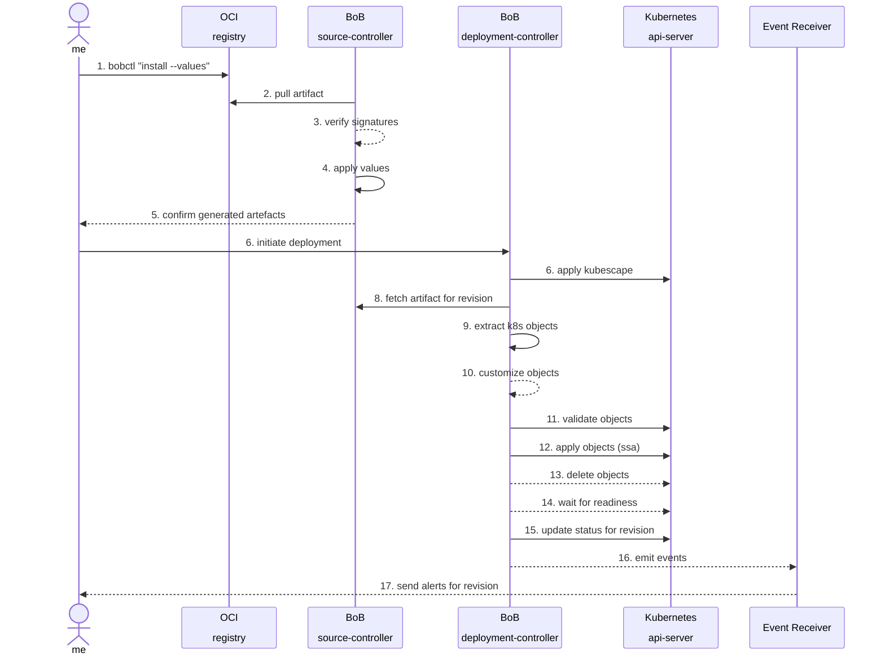
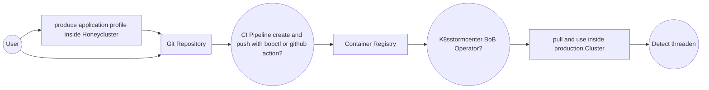

Welcome back to kubernetes. Now, we are switching sides and becoming a `customer` who uses the `webapp` product.

We now use `k3s` for the first time, which is significantly different from the `vendor` setup to showcase how the BoB translates across tech-stacks.

In this first part on the `customer` side, we need to verify and unpack the BoB


### Diagram: OCI artifacts reconciliation 



### Part 1 Verfication

<!--
### Consuming artifacts - Idea

 On the server side, bob-artifact integrates with tools like k8sstormcenter to deploy and monitor eBPF artifacts. It collects runtime data, such as syscall traces and network activity, to identify potential vulnerabilities and attack vectors.

Example tracing policy for k8sstormcenter:

__NOTE__: How controller consume bob-artifact? Which information are needed?
- Format like Falco rule set?
- SBOM Format
- Which artifact references of images or software components are needed?

```yaml
apiVersion: source.k8sstormcenter.io/v1alpha1
kind: OCIRepository
metadata:
  name: k8sstormcenter-honey
  namespace: default
spec:
  interval: 10m
  url: oci://ghcr.io/k8sstormcenter/manifests/honey
  ref:
    tag: latest
---
apiVersion: kustomize.k8sstormcenter.io/v1alpha1
kind: BoB
metadata:
  name: honey
  namespace: default
spec:
  interval: 10m
  targetNamespace: default
  prune: true
  sourceRef:
    kind: OCIRepository
    name: k8sstormcenter-honey
  path: ./
```

On the server-side, K8sstormcenter pulls OCI artifacts from container registries, extracts the ApplicationProfile as kubernetes manifests and reconciles them on the tracking controller.

## Workflow examples

Following are examples for deploying a demo application profile to Kubernetes using manifests stored in git.

__Note__: How the bob deploy flow works?

- Config?
- Create bob profile by using the application inside a HoneyCluster. 
- Extract the profile and store to folder/git
- Create and push bob to oci registry
- Production controller pull oci artifact and use it inside cluster
- Controller protocol threads
-->



### Deploy stable on production

Push the latest release from Git to the container registry:

```shell
git checkout x.x.x

bobctl push artifact oci://registry.iximiuz.com/k8sstormcenter/manifests/honey:$(git tag --points-at HEAD) \
	--path="./kustomize" \
	--source="$(git config --get remote.origin.url)" \
	--revision="$(git tag --points-at HEAD)@sha1:$(git rev-parse HEAD)"
```

Tag the release as stable:

```shell
bobctl tag artifact oci://registry.iximiuz.com/8sstormcenter/manifests/honey:$(git tag --points-at HEAD) \
  --tag stable
```

Deploy the latest stable build on the production cluster:

```yaml
apiVersion: source.k8sstormcenter.io/v1alpha1
kind: OCIRepository
metadata:
  name: k8sstormcenter-honey
  namespace: default
spec:
  interval: 5m
  url: oci://registry.iximiuz.com/k8sstormcenter/manifests/honey
  ref:
    tag: stable
```

Or deploy the latest version by semver:

```yaml
apiVersion: k8sstormcenter.io/v1alpha1
kind: OCIRepository
metadata:
  name: k8sstormcenter-honey
  namespace: default
spec:
  interval: 5m
  url: oci://registry.iximiuz.com/k8sstormcenter/manifests/honey
  ref:
    semver: ">=1.0.0"
```


## Questions

- What mechanisms are available for consuming events emitted by the Bob Source Controller?
  - Are there recommended patterns or interfaces for downstream controllers or external systems to react to these events?
- What is the expected structure and content of a bob-artifact?
  - Does it include just compiled binaries, or are additional metadata, SBOMs, attestations, etc., also part of the artifact?
- How should multi-architecture support be handled within Bob?
  - Is it necessary to define a separate binary specification per architecture?
  - Should the Bob Controller be responsible for resolving the correct binary based on the target architecture?
  - How does this resolution behave in environments leveraging user-mode emulation (e.g., qemu-user, binfmt_misc)?
- What is the recommended approach to enable local Cosign + Rekor integration in environments where upstream tools lack native support?
  - For instance:
    - FluxCD does not support Cosign signing with Rekor integration out of the box.
    - The Falco project currently does not offer signing support for its artifacts.
  - Are there best practices or workarounds to enable trust workflows in these cases?
- How should Bob reference container images in the supply chain?
  - Should the reference be a conventional container image tag/digest?
  - Or should it be modeled using in-toto provenance (e.g., linking to SBOMs or signed attestations)?
- Who is responsible for implementing the Bob CLI and controller components?
  - Is this handled by a specific team or working group?
  - Are there any existing maintainers or contributors assigned to this effort?
How can support for additional source types be integrated into the system?
  - Are there extension points or plugin mechanisms available?
  - What would be the process for adding new source types (e.g., Git, OCI, HTTP, S3, etc.)?
- Include architectural diagrams and reference links to illustrate the overall system design.
  - Visualizing the component interactions, artifact flow, and trust chain would greatly enhance understanding.
  - References to related projects or specifications (e.g., OCI, in-toto, Cosign) would provide valuable context.

