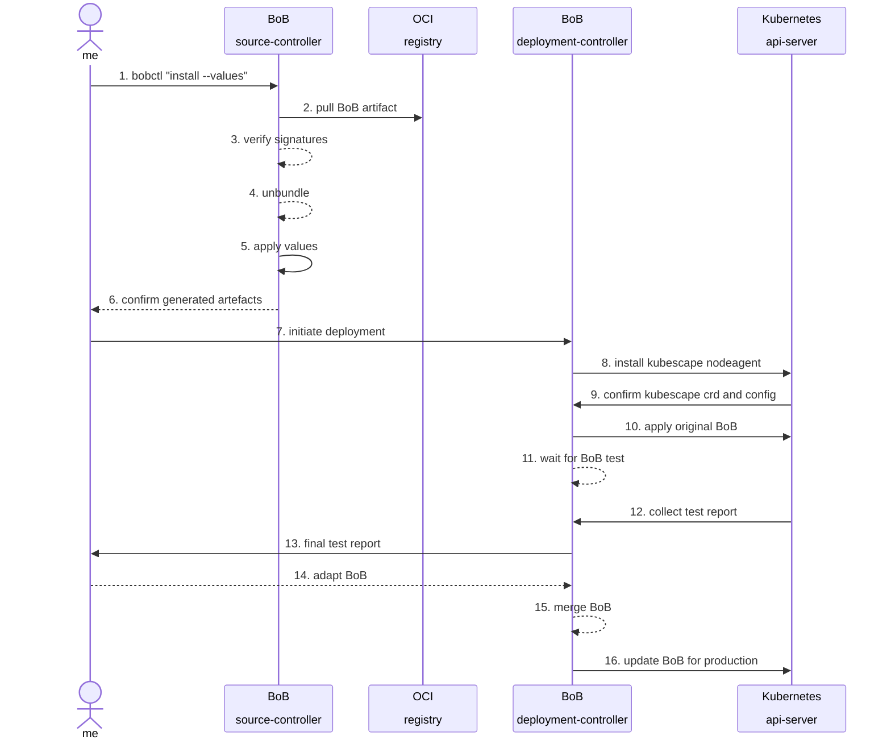
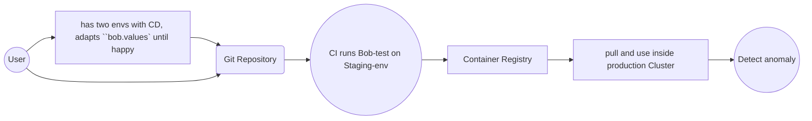

Welcome back to kubernetes. Now, we are switching sides and becoming a `customer` who uses the `webapp` product.

We now use `k3s` for the first time, which is significantly different from the `vendor` setup to showcase how the BoB translates across tech-stacks.

In this first part on the `customer` side, we need to verify and unpack the BoB.

What this means is that there is a part where we pull the artefact and verify the signature.
Then, we test deploy the application including the BoB and verify the runtime-deployment.

Afterwards, the customer may choose to use the runtime-rules during production or adopt them to their own liking.

::remark-box
---
kind: warning
---
__It is crucial, that the vendor can only supply a BoB for a __subset__ of all possible runtime configurations__, this part can
be directly verified during the `BoB test`, the customer is expected to modify the bob.values or merge the bob.yaml into 
their own environment.
::

### Diagram: BoB installation and verification 

### Part 1 Verfication aka BoB Test

We imagine that the `BoB-test` would be run via automation on a lower environment, on which load-tests are being conducted.
Just like in most installations, we assume the `values` will be iteratively adapted until stable.

Once considered stable, the merged bob.yaml and the adapted bob.values can be used in production , without the test phase.

::remark-box
---
kind: warning
---
TODO C: sketch here how to run bob-test in CI
::

### Merging multiple BoBs 

Lets talk about how BoBs must be `additive` and `composable` .

And also how they must be customizable to the clients different environments. 

::remark-box
---
kind: warning
---
TODO C: sketch here how to merge artefacts
::

