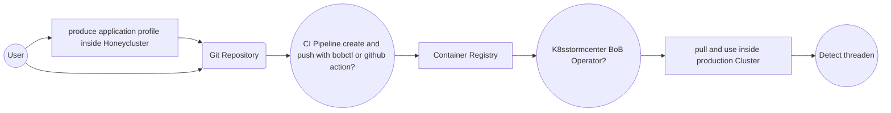
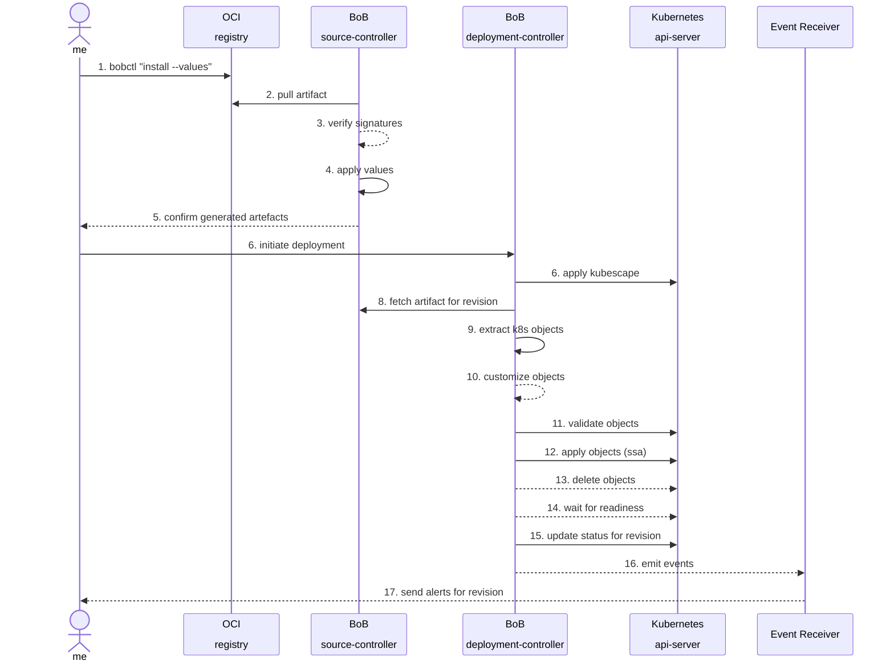

Welcome back to kubernetes. Now, we are switching sides and becoming a `customer` who uses the `webapp` product.

We now use `k3s` for the first time, which is significantly different from the `vendor` setup to showcase how the BoB translates across tech-stacks.

In this first part on the `customer` side, we need to verify and unpack the BoB

### Part 1 Verfication

<!--
### Consuming artifacts - Idea

 On the server side, bob-artifact integrates with tools like k8sstormcenter to deploy and monitor eBPF artifacts. It collects runtime data, such as syscall traces and network activity, to identify potential vulnerabilities and attack vectors.

Example tracing policy for k8sstormcenter:

__NOTE__: How controller consume bob-artifact? Which information are needed?
- Format like Falco rule set?
- SBOM Format
- Which artifact references of images or software components are needed?

```yaml
apiVersion: source.k8sstormcenter.io/v1alpha1
kind: OCIRepository
metadata:
  name: k8sstormcenter-honey
  namespace: default
spec:
  interval: 10m
  url: oci://ghcr.io/k8sstormcenter/manifests/honey
  ref:
    tag: latest
---
apiVersion: kustomize.k8sstormcenter.io/v1alpha1
kind: BoB
metadata:
  name: honey
  namespace: default
spec:
  interval: 10m
  targetNamespace: default
  prune: true
  sourceRef:
    kind: OCIRepository
    name: k8sstormcenter-honey
  path: ./
```

On the server-side, K8sstormcenter pulls OCI artifacts from container registries, extracts the ApplicationProfile as kubernetes manifests and reconciles them on the tracking controller.

## Workflow examples

Following are examples for deploying a demo application profile to Kubernetes using manifests stored in git.

__Note__: How the bob deploy flow works?

- Config?
- Create bob profile by using the application inside a HoneyCluster. 
- Extract the profile and store to folder/git
- Create and push bob to oci registry
- Production controller pull oci artifact and use it inside cluster
- Controller protocol threads
-->



### Deploy stable on production

Push the latest release from Git to the container registry:

```shell
git checkout x.x.x

bobctl push artifact oci://registry.iximiuz.com/k8sstormcenter/manifests/honey:$(git tag --points-at HEAD) \
	--path="./kustomize" \
	--source="$(git config --get remote.origin.url)" \
	--revision="$(git tag --points-at HEAD)@sha1:$(git rev-parse HEAD)"
```

Tag the release as stable:

```shell
bobctl tag artifact oci://registry.iximiuz.com/8sstormcenter/manifests/honey:$(git tag --points-at HEAD) \
  --tag stable
```

Deploy the latest stable build on the production cluster:

```yaml
apiVersion: source.k8sstormcenter.io/v1alpha1
kind: OCIRepository
metadata:
  name: k8sstormcenter-honey
  namespace: default
spec:
  interval: 5m
  url: oci://registry.iximiuz.com/k8sstormcenter/manifests/honey
  ref:
    tag: stable
```

Or deploy the latest version by semver:

```yaml
apiVersion: k8sstormcenter.io/v1alpha1
kind: OCIRepository
metadata:
  name: k8sstormcenter-honey
  namespace: default
spec:
  interval: 5m
  url: oci://registry.iximiuz.com/k8sstormcenter/manifests/honey
  ref:
    semver: ">=1.0.0"
```

## Authentication

Bob Artifacts works with Docker Hub, GitHub and GitLab Container Registry,
ACR, ECR, GAR, Harbor, self-hosted Docker Registry and
any other registry which supports custom OCI media types.

For authentication purposes, the `bobctl <verb> artifact` commands are using the `~/.docker/config.json`
config file and the Docker credential helpers.

__NOTE__: Login to GitHub Container Registry example:

```shell
echo ${GITHUB_PAT} | docker login ghcr.io -u ${GITHUB_USER} --password-stdin
```

__Note__: We use local lab registry `registry.iximiuz.com`!

To pull artifacts in Kubernetes clusters, BoB Operator can authenticate to container registries
using image pull secrets or IAM role bindings to the `bob-controller` service account.

Generate an image pull secret for GitHub Container Registry example:

```shell
bobctl create secret oci ghcr-auth \
  --url=ghcr.io \
  --username=bob \
  --password=${GITHUB_PAT}
```

Then reference the secret in the `OCIRepository` with:

```yaml
apiVersion: source.k8sstormcenter.io/v1alpha1
kind: OCIRepository
metadata:
  name: k8sstormcenter-honey
  namespace: default
spec:
  interval: 5m
  url: oci://registry.iximiuz.com/k8sstormcenter/manifests/honey
  provider: generic
  secretRef:
    name: ghcr-auth
```

### Contextual Authorization

When running BoB on managed Kubernetes clusters like EKS, AKS or GKE, you
can set the `provider` field to `azure`, `aws` or `gcp` and BoB will use
the Kubernetes node credentials or an IAM Role binding to pull artifacts
without needing an image pull secret.

For more details on how to setup contextual authorization for Azure, AWS and Google Cloud please see:

- [OCIRepository documentation](/bob/components/source/ocirepositories/#provider)

## Signing and verification

BoB comes with support for verifying OCI artifacts signed with [Sigstore Cosign](https://github.com/sigstore/cosign)
or [Notaryproject notation](https://github.com/notaryproject/notation).

To secure your delivery pipeline, you can sign the artifacts and configure Flux
to verify the artifacts' signatures before they are downloaded and reconciled in production.

### Cosign Workflow example

```shell
COSIGN_VERSION=$(curl -s https://api.github.com/repos/sigstore/cosign/releases/latest | grep tag_name | cut -d '"' -f4)
curl -sLo cosign "https://github.com/sigstore/cosign/releases/download/${COSIGN_VERSION}/cosign-linux-amd64"
chmod +x cosign
sudo mv cosign /usr/local/bin/
```

Generate a Cosign key-pair and create a Kubernetes secret with the public key:

```shell
cosign version
cosign generate-key-pair

kubectl -n default create secret generic cosign-pub \
  --from-file=cosign.pub=cosign.pub
```

Push and sign the artifact using the Cosign private key:

```shell
bobctl push artifact oci://registry.iximiuz.com/k8sstormcenter/manifests/honey:$(git tag --points-at HEAD) \
	--path="./kustomize" \
	--source="$(git config --get remote.origin.url)" \
	--revision="$(git tag --points-at HEAD)@sha1:$(git rev-parse HEAD)"

cosign sign --key=cosign.key registry.iximiuz.com//k8sstormcenter/manifests/honey:$(git tag --points-at HEAD)
```

Configure k8sstormcenter to verify the artifacts using the Cosign public key from the Kubernetes secret:

```yaml
apiVersion: source.k8sstormcenter.io/v1alpha1
kind: OCIRepository
metadata:
  name: k8sstormcenter-honey
  namespace: default
spec:
  interval: 5m
  url: oci://registry.iximiuz.com/k8sstormcenter/manifests/honey
  ref:
    semver: "*"
  verify:
    provider: cosign
    secretRef:
      name: cosign-pub
```

{}
For publicly available OCI artifacts, which are signed using
the [Cosign Keyless](https://docs.sigstore.dev/cosign/keyless/)
method, you can enable the verification by omitting the `.verify.secretRef` field.

Note that keyless verification is an **experimental feature**, using
custom root CAs or self-hosted Rekor instances are not currently supported.
{}

### Notary Workflow example

Generate a local signing key pair:

```shell
openssl req -x509 -sha256 -nodes -newkey rsa:2048 \
-keyout <name>.key \
-out <name>.crt \
-days 365 \
-subj "/C=DE/ST=NRW/L=Bochum/O=Notary/CN=<name>" \
-addext "basicConstraints=CA:false" \
-addext "keyUsage=critical,digitalSignature" \
-addext "extendedKeyUsage=codeSigning"
```

Configure notation to use the local key:

```shell
cat <<EOF > ~/.config/notation/signingkeys.json
{
    "default": "<key-name>"
    "keys": [
        {
            "name": "<key-name>",
            "keyPath": "<path-to-key>.key",
            "certPath": "<path-to-cert>.crt"
        }
    ]
}
```

You should now be able to list the keys:

```shell
notation key ls
```

It is also possible to generate a test certificate:

```shell
# Generate a certificate and RSA key pair
notation cert generate-test valid-example
```

{}
The test certificate is not suitable for production use. Please 
visit the [notation documentation](https://notaryproject.dev/docs/user-guides/how-to/plugin-management/)
for more information on how to use the notation plugin for production.
{}

Push and sign the artifact using the certificate's private key:

```shell
bobctl push artifact oci://registry.iximiuz.com/k8sstormcenter/manifests/honey:$(git tag --points-at HEAD) \
	--path="./kustomize" \
	--source="$(git config --get remote.origin.url)" \
	--revision="$(git tag --points-at HEAD)@sha1:$(git rev-parse HEAD)"

notation sign registry.iximiuz.com/k8sstormcenter/manifests/honey:$(git tag --points-at HEAD) -k <key-name>
```

Create a `trustpolicy.json` file:

```json
{
    "version": "1.0",
    "trustPolicies": [
        {
            "name": "<policy-name>",
            "registryScopes": [ 
                "registry.iximiuz.com/k8sstormcenter/manifests/honey"
             ],
            "signatureVerification": {
                "level" : "strict" 
            },
            "trustStores": [ "ca:<store-name>" ],
            "trustedIdentities": [
                "x509.subject: C=DE, ST=NRW, L=Bochum, O=Notary, CN=<name>"
            ]
        }
    ]
}
```

{}
For more details see [trust policy spec](https://github.com/notaryproject/specifications/blob/main/specs/trust-store-trust-policy.md#trust-policy)
{}

Generate a kubernetes secret with the certificate and trust policy:

```shell
bobctl create secret notation notation-cfg \
    --namespace=<namespace> \
    --trust-policy-file=<trust-policy-file-path> \
    --ca-cert-file=<ca-cert-file-path>
```

Configure Bob to verify the artifacts using the Notary trust policy and certificate:

```yaml
apiVersion: source.k8sstormcenter.io/v1alpha1
kind: OCIRepository
metadata:
  name: k8sstormcenter-honey
  namespace: default
spec:
  interval: 5m
  url: oci://registry.iximiuz.com/k8sstormcenter/manifests/honey
  ref:
    semver: "*"
  verify:
    provider: notation
    secretRef:
      name: notation-cfg
```

### Verification status

If the verification succeeds, BoB adds a condition with the
following attributes to the OCIRepository's `.status.conditions`:

- `type: SourceVerified`
- `status: "True"`
- `reason: Succeeded`

If the verification fails, BoB will set the `SourceVerified` status to `False`
and will not fetch the artifact contents from the registry. The verification
failure will report this to the OCIRepository ready status message.

```console
$ kubectl -n default describe ocirepository.source.k8sstormcenter.io k8sstormcenter-honey

Status:                        
  Conditions:
    Last Transition Time:     2025-04-18T00:42:21Z
    Message:                  failed to verify the signature using provider 'cosign': no matching signatures were found
    Observed Generation:      1
    Reason:                   VerificationError
    Status:                   False
    Type:                     Ready
```

Verification failures are also visible when running `bobctl get sources oci` and in Kubernetes events.

## Git commit status updates

Another important reason to specify the Git revision when publishing
artifacts with `bobctl push` is for benefiting from BoB's integration
with Git notification providers that support commit status updates:

```shell
bobctl push artifact oci://<repo url> --path=<manifests dir> \
	--source="$(git config --get remote.origin.url)" \
	--revision="$(git branch --show-current)@sha1:$(git rev-parse HEAD)"
```

When `bob-controller` finds OCI artifacts containing a revision
specified like in the example above, this *origin revision* is added
on events.


### Diagram: OCI artifacts reconciliation 



## Questions

- What mechanisms are available for consuming events emitted by the Bob Source Controller?
  - Are there recommended patterns or interfaces for downstream controllers or external systems to react to these events?
- What is the expected structure and content of a bob-artifact?
  - Does it include just compiled binaries, or are additional metadata, SBOMs, attestations, etc., also part of the artifact?
- How should multi-architecture support be handled within Bob?
  - Is it necessary to define a separate binary specification per architecture?
  - Should the Bob Controller be responsible for resolving the correct binary based on the target architecture?
  - How does this resolution behave in environments leveraging user-mode emulation (e.g., qemu-user, binfmt_misc)?
- What is the recommended approach to enable local Cosign + Rekor integration in environments where upstream tools lack native support?
  - For instance:
    - FluxCD does not support Cosign signing with Rekor integration out of the box.
    - The Falco project currently does not offer signing support for its artifacts.
  - Are there best practices or workarounds to enable trust workflows in these cases?
- How should Bob reference container images in the supply chain?
  - Should the reference be a conventional container image tag/digest?
  - Or should it be modeled using in-toto provenance (e.g., linking to SBOMs or signed attestations)?
- Who is responsible for implementing the Bob CLI and controller components?
  - Is this handled by a specific team or working group?
  - Are there any existing maintainers or contributors assigned to this effort?
How can support for additional source types be integrated into the system?
  - Are there extension points or plugin mechanisms available?
  - What would be the process for adding new source types (e.g., Git, OCI, HTTP, S3, etc.)?
- Include architectural diagrams and reference links to illustrate the overall system design.
  - Visualizing the component interactions, artifact flow, and trust chain would greatly enhance understanding.
  - References to related projects or specifications (e.g., OCI, in-toto, Cosign) would provide valuable context.


Please here all the things that BoB needs to do analogously to SBOM for client side to verify it

::simple-task
---
:tasks: tasks
:name: trigger_event
---
#active
You are reading

#completed
You are now looking at this example task as finished in Module 2 Lesson 2, means it loaded correctly
::
---