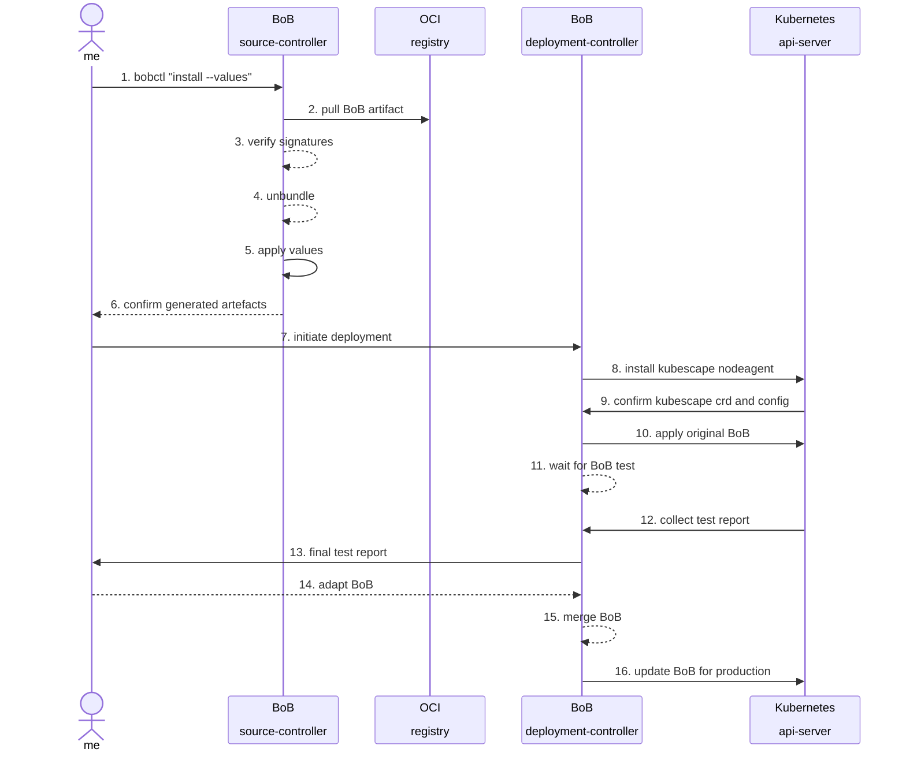

__THIS PART WILL SHOW HOW BOBCTL IMPLEMENTS BOB-TEST__

Welcome back to kubernetes. Now, we are switching sides and becoming a `customer` who uses the `webapp` product.

We now use `k3s` for the first time, which is significantly different from the `vendor` setup to showcase how the BoB translates across tech-stacks.

In this first part on the `customer` side, we need to verify and unpack the BoB.

What this means is that there is a part where we pull the artefact and verify the signature.
Then, we test deploy the application including the BoB and verify the runtime-deployment.

Afterwards, the customer may choose to use the runtime-rules during production or adopt them to their own liking.


::remark-box
---
kind: warning
---
__It is crucial, that the vendor can only supply a BoB for a __subset__ of all possible runtime configurations__, this part can
be directly verified during the `BoB test`, the customer is expected to modify the bob.values or merge the bob.yaml into 
their own environment.
::

### Diagram: BoB installation and verification 



### Part 1 Verfication aka BoB Test

We imagine that the `BoB-test` would be run via automation on a lower environment, on which load-tests are being conducted.
Just like in most installations, we assume the `values` will be iteratively adapted until stable.

(mermaid remove due to timeouts)


Once considered stable, the merged bob.yaml and the adapted bob.values can be used in production , without the test phase.


WIP: we shall assume we fetched the artefact and upacked the metadata


```git
git clone https://github.com/k8sstormcenter/honeycluster.git
cd honeycluster
git checkout 162-write-bob-testscript-for-anyone-to-contribute-a-bob-for-the-pingapps
```

*bobctl pull*
```
oras manifest fetch $IMAGE --pretty --plain-http
untar ...
```

*bobctl test*
```bash
make kubescape-bob-kind
sudo apt install -y python3-yaml
cd traces/kubescape-verify/attacks/bob
python3 bob.py 
kubectl apply -f processed_bob_generated.yaml 
```
```
applicationprofile.spdx.softwarecomposition.kubescape.io/replicaset-webapp-d87cdd796 created
```

In a new tab, tail the kubescape logs
```bash
kubectl logs -n honey -l app=node-agent -f -c node-agent
```

Back in the first tab:
```sh
kubectl apply -f bob.test
```
```
laborant@dev-machine:bob$ kubectl apply -f bob.test
deployment.apps/webapp created
deployment.apps/testapp created
service/webapp created
role.rbac.authorization.k8s.io/webapp-role created
rolebinding.rbac.authorization.k8s.io/webapp-role-binding created
```


Over in the kubescape logs we see two alerts:
```json
{"BaseRuntimeMetadata":{"alertName":"Unexpected system call","arguments":{"syscall":"gettid"},"infectedPID":11278,"md5Hash":"4e79f11b07df8f72e945e0e3b3587177","sha1Hash":"b361a04dcb3086d0ecf960d3acaa776c62f03a55","severity":1,"size":"730 kB","timestamp":"2025-05-14T18:44:43.123308596Z","trace":{}},"CloudMetadata":null,"RuleID":"R0003","RuntimeK8sDetails":{"clusterName":"honeycluster","containerName":"ping-app","hostNetwork":false,"namespace":"default","containerID":"41df552eada80c2de3779f67b599eece57450a330be252e97d7d0aa3bb41e4d5","podName":"webapp-d87cdd796-tcml8","podNamespace":"default","workloadName":"webapp","workloadNamespace":"default","workloadKind":"Deployment"},"RuntimeProcessDetails":{"processTree":{"pid":11278,"cmdline":"apache2 -DFOREGROUND","comm":"apache2","ppid":11128,"pcomm":"containerd-shim","uid":0,"gid":0,"startTime":"0001-01-01T00:00:00Z","cwd":"/var/www/html","path":"/usr/sbin/apache2"},"containerID":"41df552eada80c2de3779f67b599eece57450a330be252e97d7d0aa3bb41e4d5"},"event":{"runtime":{"runtimeName":"containerd","containerId":"41df552eada80c2de3779f67b599eece57450a330be252e97d7d0aa3bb41e4d5"},"k8s":{"node":"node-02","namespace":"default","podName":"webapp-d87cdd796-tcml8","podLabels":{"app":"webapp","pod-template-hash":"d87cdd796"},"containerName":"ping-app","owner":{}},"timestamp":1747248283123308596,"type":"normal"},"level":"error","message":"Unexpected system call: gettid","msg":"Unexpected system call","time":"2025-05-14T18:44:43Z"}
{"BaseRuntimeMetadata":{"alertName":"Unexpected system call","arguments":{"syscall":"tkill"},"infectedPID":11278,"md5Hash":"4e79f11b07df8f72e945e0e3b3587177","sha1Hash":"b361a04dcb3086d0ecf960d3acaa776c62f03a55","severity":1,"size":"730 kB","timestamp":"2025-05-14T18:44:43.133316166Z","trace":{}},"CloudMetadata":null,"RuleID":"R0003","RuntimeK8sDetails":{"clusterName":"honeycluster","containerName":"ping-app","hostNetwork":false,"namespace":"default","containerID":"41df552eada80c2de3779f67b599eece57450a330be252e97d7d0aa3bb41e4d5","podName":"webapp-d87cdd796-tcml8","podNamespace":"default","workloadName":"webapp","workloadNamespace":"default","workloadKind":"Deployment"},"RuntimeProcessDetails":{"processTree":{"pid":11278,"cmdline":"apache2 -DFOREGROUND","comm":"apache2","ppid":11128,"pcomm":"containerd-shim","uid":0,"gid":0,"startTime":"0001-01-01T00:00:00Z","cwd":"/var/www/html","path":"/usr/sbin/apache2"},"containerID":"41df552eada80c2de3779f67b599eece57450a330be252e97d7d0aa3bb41e4d5"},"event":{"runtime":{"runtimeName":"containerd","containerId":"41df552eada80c2de3779f67b599eece57450a330be252e97d7d0aa3bb41e4d5"},"k8s":{"node":"node-02","namespace":"default","podName":"webapp-d87cdd796-tcml8","podLabels":{"app":"webapp","pod-template-hash":"d87cdd796"},"containerName":"ping-app","owner":{}},"timestamp":1747248283133316166,"type":"normal"},"level":"error","message":"Unexpected system call: tkill","msg":"Unexpected system call","time":"2025-05-14T18:44:43Z"}
```

Analysis:

`syscall":"tkill` is likely harmless and `{"syscall":"gettid"}` is a known difference between k8s and k3s (dont ask me why) 

Otherwise there are only the start/stop notices. So: in this case: our test is accepted. HURRAY


```
kubectl delete -f bob.test
```


### Merging multiple BoBs 

Lets talk about how BoBs must be `additive` and `composable` .

And also how they must be customizable to the clients different environments. 

*bob merge*

::remark-box
---
kind: warning
---
TODO C: we need to collect the kubescape output and present it to the user, e.g. informing them about this known 1 syscall difference. The patching is highly suboptimal this way, think of it as a sketch, please
::

in this case, our customer , on preprod, would now add the allowed syscall into the bob:
```sh
kubectl patch applicationprofile \
replicaset-webapp-d87cdd796 --type='json'\
 -p='[{"op": "add", "path": "/spec/containers/0/syscalls/-", "value":"gettid"}]'
```


::remark-box
---
kind: warning
---
TODO: For this lab to work we need to publish our bob into some registry that will survive the playground switching.
::

